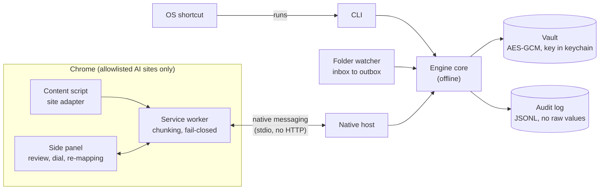
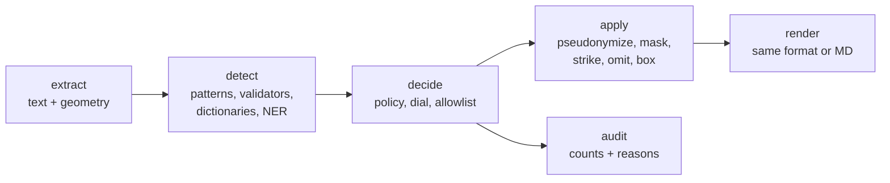

# Redactit: implementation plan

Redactit removes sensitive data from text, Markdown, DOCX, PDF and images **on the user's
machine** before any of it reaches an LLM chat (Claude, ChatGPT, Gemini). This document
fixes the stack, the file layout, the risks, and the order of delivery. It changes only
through a reviewed PR.

## 1. Scope

**In the MVP**

- Formats: plain text, Markdown, DOCX (to redacted Markdown), PDF (to image-only PDF plus
  Markdown), PNG/JPEG images.
- Interfaces: CLI, Chrome native-messaging host, folder watcher (`inbox/` to `outbox/`),
  clipboard redaction on an OS keyboard shortcut.
- Chrome MV3 extension with adapters for claude.ai and chatgpt.com, and a
  "Redact & copy" fallback that also covers gemini.google.com.
- Policy file, encrypted pseudonym vault, JSONL audit log, leak test, install scripts.
- English only.

**Not in the MVP**

| Item | Why deferred |
|---|---|
| Audio | Removed from scope. Also removes the only LGPL dependency (FFmpeg via PyAV). |
| Policy assistant | Online, admin-only config tool. Planned as Phase 8, after the MVP ships. |
| Full Gemini adapter | Gemini gets the fallback only; its UI changes often. |
| Pseudonyms shared across chats | Linking chats raises re-identification risk. |
| Remote log forwarding (SIEM) | Needs network egress; contradicts the offline engine. |
| Other browsers, other languages | Scope control. |

## 2. Architecture



Every interface calls the same pipeline. Format modules only extract and render; they
never decide what is sensitive.



Core types (in `types.py`):

- `Segment`: a run of text plus optional geometry (page, boxes per character or word).
- `Span`: `start`, `end`, `entity_type`, `score`, `detector`, `validated`.
- `Decision`: a `Span` plus `action`, `policy_rule_id`, and `reason`. The reason is built
  from the rule, detector, score and dial. It never contains matched text.

## 3. Stack

Runtime dependencies must be MIT, Apache-2.0 or BSD. Exceptions are listed in section 8.

| Concern | Choice | License | Why this one |
|---|---|---|---|
| Language | Python 3.12, `uv` for envs | PSF / MIT | Required by the brief; `uv` gives a lockfile. |
| Detection framework | Presidio analyzer + anonymizer | MIT | Recognizer registry, context scoring and operators already exist. |
| NER | GLiNER with a PII-tuned checkpoint | Apache-2.0 (package) | See 3.1. |
| NLP engine for Presidio | spaCy `en_core_web_sm` | MIT | Tokenisation only; GLiNER does the entity work. |
| Validators, secrets | In-house (Luhn, IBAN mod-97, SIN, SSN, NINO, key formats) | n/a | Each is under 20 lines. `python-stdnum` is LGPL, so it is excluded. |
| PDF | `pypdfium2` | Apache-2.0 / BSD-3 | Text with character boxes plus page rendering. PyMuPDF is AGPL, so it is excluded. |
| PDF rebuild | `pypdfium2`: a new document of JPEG page images | Apache-2.0 / BSD-3 | Writes raster pages only, never a text layer. `img2pdf` is LGPL, so it is excluded. |
| OCR | RapidOCR on `onnxruntime` | Apache-2.0 / MIT | Installs with pip, word boxes, ONNX files can be pinned. |
| Faces | OpenCV YuNet (`opencv-python-headless`) | Apache-2.0 | Small, CPU-fast, returns boxes. |
| QR / barcodes | `zxing-cpp` | Apache-2.0 | Detects and locates many symbologies. `pyzbar` needs `zbar` (LGPL). |
| DOCX | `zipfile` + `defusedxml` walk of the OOXML parts | PSF (flagged) | Blocks XML entity attacks. `python-docx` does not expose comments or tracked changes well. |
| Vault | `cryptography` AES-256-GCM, `sqlite3`, `keyring` | Apache-2.0 / BSD, MIT | Key lives in the OS keychain, never on disk. |
| Policy | `PyYAML` `safe_load` + `pydantic` | MIT | Typed, validated config with clear errors. |
| CLI | `argparse` | PSF | Standard library, one less dependency. |
| Folder watcher | `watchdog` | Apache-2.0 | Cross-platform file events. |
| Clipboard | `ctypes` (Windows), `pyobjc` (macOS), `wl-paste`/`xclip` (Linux) | PSF / MIT / external process | Reads the "concealed" markers that password managers set. |
| Tests | `pytest`, `pytest-socket`, `Faker` | MIT | `pytest-socket` makes any network call fail the test. |
| Test corpus | `reportlab` (digital PDFs), `Faker` | BSD / MIT | Builds the synthetic corpus. Test-only. The verifier reuses the runtime PDF, OCR, barcode and face libraries with its own settings. |
| Build backend | `hatchling` | MIT | Standard PEP 517 backend for `uv`. |
| Extension | MV3, plain JavaScript + JSDoc, no build step | n/a | What Chrome loads is exactly what is reviewed. |

### 3.1 NER choice: Presidio + GLiNER

The acceptance bar is zero surviving seeded values, so recall matters more than speed.

- spaCy's general NER is trained on news text. It misses unusual names and does not
  know PII-specific labels such as passport numbers or account IDs.
- GLiNER is a compact bidirectional transformer that matches spans against label
  descriptions at inference time. PII-tuned checkpoints cover names, addresses, dates of
  birth, IDs and more, and new labels need no retraining.
- Presidio wraps GLiNER as one recognizer among many. Validated patterns (cards, IBAN,
  national IDs) never depend on the model at all.
- Cost: GLiNER is slower on CPU than spaCy and adds a model of a few hundred MB. That is
  acceptable for paste-sized inputs. Large PDFs are processed per page.

**Checkpoint:** `knowledgator/gliner-pii-base-v1.0` (Apache-2.0, English-tuned, 60+ PII
labels, ships ONNX weights). `knowledgator/gliner-pii-edge-v1.0` is the lighter fallback
if shortcut latency is too high. `nvidia/gliner-PII` is excluded because it uses a custom
license. The model runs outside Presidio (see the decision below); its spans join the
Presidio pattern spans before the policy decides. Revision and SHA-256 are pinned in
`src/redactit/models.lock.json`.

**Decided in Phase 2:** the `gliner` package (and its `torch` dependency, whose bundled
MKL license was unverified) is not used. `detect/ner.py` runs the full-precision ONNX
export directly on `onnxruntime` with `tokenizers` in about 60 lines. The quantised export
was rejected: it scored 4 of 15 synthetic addresses below the default threshold.

## 4. File layout

```text
Redactit/
├─ pyproject.toml            # deps, entry point `redactit`
├─ uv.lock
├─ src/redactit/models.lock.json  # model URL (pinned revision) and SHA-256
├─ src/redactit/policy.default.yaml  # annotated default policy, the base layer
├─ src/redactit/
│  ├─ cli.py                 # redact, verify, clip, watch, setup-models
│  ├─ types.py               # Segment, Span, Decision
│  ├─ pipeline.py            # extract -> detect -> decide -> apply -> render
│  ├─ policy.py              # schema, managed + user layering, dial thresholds
│  ├─ pseudonym.py           # [TYPE_N] allocation per chat scope
│  ├─ vault.py               # encrypted mapping store, 30-day purge
│  ├─ audit.py               # JSONL writer, sanitised reasons only
│  ├─ safety.py              # blocks IP sockets and DNS inside the engine
│  ├─ managed.py             # OS-derived admin policy path, admin-ownership check
│  ├─ models.py              # load-time SHA-256 verification
│  ├─ detect/
│  │  ├─ patterns.py         # regexes + validators (Luhn, IBAN, SIN, SSN, NINO)
│  │  ├─ secrets.py          # API key and token formats, PEM blocks, JWTs
│  │  ├─ dictionary.py       # company terms, allowlist
│  │  └─ ner.py              # GLiNER on onnxruntime, token-budget windows
│  ├─ formats/
│  │  ├─ text.py             # .txt / .md
│  │  ├─ docx.py             # body, headers, footers, notes, comments, revisions
│  │  ├─ pdf.py              # text layer + raster pipeline, rebuild
│  │  └─ image.py            # OCR + faces + codes, fill, re-encode
│  ├─ ocr.py                 # RapidOCR wrapper shared by pdf and image
│  └─ hosts/
│     ├─ native.py           # native messaging framing and chunking
│     ├─ watcher.py          # inbox -> outbox
│     └─ clipboard.py        # read, skip concealed, redact, write back
├─ extension/
│  ├─ manifest.json          # fixed `key` so the extension ID is stable
│  ├─ background.js          # native port, chunk reassembly, fail-closed
│  ├─ content/
│  │  ├─ intercept.js        # paste, drop, file input (shared)
│  │  └─ adapters/           # claude.js, chatgpt.js (one file per site)
│  └─ sidepanel/             # panel.html, panel.js, panel.css
├─ installers/
│  ├─ install.ps1            # Windows: venv, models, host registry key, shortcut
│  ├─ install.sh             # macOS + Linux
│  └─ host-manifest.json     # template; allowed_origins = our extension ID only
├─ tests/
│  ├─ corpus/                # generate.py + corpus_docx.py, corpus_media.py: seeded corpus
│  ├─ leak/run.py            # re-extract, re-OCR, score, write report
│  ├─ unit/                  # per module
│  ├─ test_offline.py        # engine run with sockets disabled
│  ├─ test_licenses.py       # fails on any non-permissive dependency
│  └─ test_leak_harness.py   # harness must see every value on unredacted input
├─ docs/
│  ├─ PLAN.md
│  ├─ THREAT_MODEL.md
│  └─ leak-reports/          # full leak report per phase
└─ .github/
   ├─ workflows/ci.yml       # Win/macOS/Linux: unit + text leak test + license check
   └─ pull_request_template.md
```

Generated corpora, leak outputs and models are git-ignored. Only generators and reports
are committed.

## 5. Per-format design

| Format | Extract | Apply | Output |
|---|---|---|---|
| Text / MD | Whole file as one segment; Markdown syntax untouched | String replacement by span | Same format |
| DOCX | Walk `document.xml`, `header*.xml`, `footer*.xml`, `footnotes.xml`, `endnotes.xml`, `comments.xml`; include `w:ins` and `w:del` runs; comment and revision authors are names; text in any other part (text boxes, charts, SmartArt, custom XML). No DTDs; at most 2000 parts and 200 MiB of XML | Replace in extracted text | `name.docx.md` with sections: Body, Headers and footers, Notes, Comments, Tracked changes, Authors, Other text. `docProps` metadata is dropped |
| PDF | Per page: text and character boxes from `pypdfium2`, placed on the rendered page through PDFium so rotated and cropped pages line up. Every page is also rendered at 200 DPI and sent through the image pipeline, which catches scanned pages, text inside embedded images, and outlined fonts. At most 500 pages and 64 MP per page | Spans map to character boxes, merged per line and padded; image-pipeline boxes are unioned in; boxes are filled and labelled `[PERSON_1]` when the action is pseudonymize | New PDF built only from the page images (no text layer, no metadata), plus `name.pdf.md` from OCR of the visible page, so text hidden under a drawn box never reaches it |
| Image | PNG, JPEG, WebP, BMP, GIF, TIFF only, at most 50 MP. OCR at full size (tiles past 4096 px), YuNet faces, zxing codes (always filled; the payload is not read) | Fill boxes on a copy of the pixels | Re-encoded from raw pixels, so EXIF and GPS never carry over; JPEG stays JPEG, the rest become PNG |

## 6. Policy, dial and pseudonyms

- **Layers.** Built-in defaults (`policy.default.yaml`), overridden by the admin's managed
  policy, then merged with the user policy. The managed path comes from the OS
  (`C:\ProgramData\Redactit\policy.yaml` via the known-folder API, `/etc/redactit`,
  `/Library/Application Support/Redactit`), never from environment variables, and a file
  the current user owns is refused. The user merge is **tighten-only**: a user can raise
  the dial, add terms, or enable types, but cannot go below the admin floor, unlock locked
  types, or allowlist values (only the admin can).
- **Per-site rules.** `sites.<host>.dial` raises the dial for one AI site (e.g. chatgpt.com
  at 4); it can never lower it.
- **Dial 1 to 5.** Maps to a per-entity-type score threshold. The default is 3, and so
  is the default admin floor: it is the lowest dial the leak test proves, so a user
  cannot go below it unless an admin lowers the floor. Contact details sit 0.05 lower;
  names and addresses from the model sit 0.15 lower, because its probabilities run lower
  than pattern scores for the same certainty.
- **Locked types** (cards, IBAN, API keys, SIN, SSN, NINO, passport numbers) are
  validator-driven and apply at every dial position.
- **Review mode** `always` or `low_confidence_only`. A review that times out blocks the
  send; it never passes content through unredacted.
- **Pseudonyms** `[PERSON_1]` are allocated per chat scope. The extension derives the
  scope from the chat URL. A brand-new chat uses a temporary scope that is re-keyed once
  the site assigns an ID. Vault entries purge after 30 days.
- **Re-mapping** of pseudonyms back to real names happens only inside the side panel,
  which is an extension page. Real names are never written into the AI site's DOM, where
  the site's scripts could read them.

## 7. Extension

- Permissions: `nativeMessaging`, `storage`, `sidePanel`. Host permissions:
  `https://claude.ai/*`, `https://chatgpt.com/*`, `https://gemini.google.com/*`.
  No `<all_urls>`, no remote code, no `eval`.
- Interception: capture-phase `paste`, `drop` and file-input `change` listeners, registered
  at `document_start`. The original event is cancelled, the payload goes to the engine,
  and the redacted text or file is inserted back.
- Fail closed: if the native port is down, times out, or returns an error, the upload is
  blocked and the user sees why. The service worker reconnects in `onDisconnect`; an open
  port usually keeps it alive, but not reliably in every Chrome build.
- Chunking: Chrome caps host-to-extension messages at 1 MB and extension-to-host messages
  at 64 MiB. Both directions use the same numbered-frame protocol (frames of 512 KiB),
  so one code path covers both.
- Review UX: `chrome.sidePanel.open()` only works synchronously inside a user gesture in
  extension code (Chrome 116+). When a paste needs review, the send is held and an
  in-page notice asks the user to click the Redactit toolbar button, which opens the panel
  with the pending review.
- Adapters: one file per site, isolated. Each adapter self-checks its selectors on load and
  disables itself (fallback only) if they are missing.

## 8. Security rules and license exceptions

- No raw content in logs, exceptions or audit entries. A logging filter and a sanitised
  exception type enforce it; the leak test also scans logs and the audit file.
- No telemetry of any kind.
- Temporary files go in a private directory (`0700` on POSIX, user-only ACL on Windows),
  deleted in `finally`. In-memory processing is the default.
- Models are downloaded once by `redactit setup-models`, pinned by SHA-256, and verified at
  every load. At runtime the engine blocks every non-Unix socket and every DNS lookup in
  its own process, so no dependency can phone home.
- CI runs a license check that fails on anything outside MIT, Apache or BSD unless it is
  listed here.
- Synthetic data only. Real documents are never committed.

**Flagged exceptions** (permissive, but not literally MIT, Apache or BSD):

| Dependency | License | Why accepted |
|---|---|---|
| Pillow | MIT-CMU (historical PIL license) | Permissive, MIT-equivalent terms; the only mature raster PDF writer without LGPL |
| defusedxml | PSF-2.0 | Permissive; the standard defence against XML entity attacks in untrusted DOCX |
| torch (only if option (a) in 3.1 is chosen) | BSD-3 plus bundled libraries | Bundled Intel MKL license is **unverified**; must be checked before it is accepted |
| pypdfium2 | BSD-3 / Apache-2.0; bundled PDFium notices mention GPL | Mentions are ICU's autoconf macros (GPL with the Autoconf exception, build scripts only) and the LLVM exception clause; no copyleft code in the binary |
| OpenCV wheels (runtime from Phase 3: RapidOCR, YuNet) | Apache-2.0, but every wheel bundles FFmpeg (LGPL-2.1) as a separate DLL | **Accepted by the owner (option A).** LGPL permits unmodified dynamic use in closed or open products; `THIRD_PARTY_NOTICES.md` carries the license texts and the exact source links. Before a commercial release, a lawyer should check codec patents in the bundled FFmpeg (Redactit never decodes video). Fallbacks if needed: OpenCV built without FFmpeg, or Tesseract. |

Runtime exceptions accepted by the owner (used unmodified; obligations attach only to
changes in their own files): certifi (MPL-2.0, via requests/httpx), setuptools (MIT, vendoring
LGPL-3 and MPL-2.0 files, required by spaCy), typing-extensions (PSF-2.0).

Also shipped from Phase 3 via `rapidocr-onnxruntime`, enforced in `tests/test_licenses.py`:
numpy (BSD/MIT/Zlib/CC0 plus the GCC runtime exception), tqdm (MPL-2.0 AND MIT), shapely
(bundled GEOS, LGPL-2.1).

Excluded after checking: PyMuPDF and Ghostscript (AGPL), `img2pdf` (LGPL-3), `python-stdnum`
(LGPL-2.1+), `zbar` behind `pyzbar` (LGPL-2.1), PyAV (removed with audio).
Linux clipboard access calls `wl-paste`/`xclip` as external processes; they are not
linked into Redactit.

## 9. Leak test (acceptance)

1. `tests/corpus/generate.py --seed N` writes documents in every format, with the seeded
   values recorded in a manifest. It includes hard cases: values split across lines, cards
   with spaces or dashes, PII in DOCX headers, comments and deleted revisions, text inside
   images embedded in PDFs, rotated and cropped PDF pages, low-contrast and rotated text,
   small text in a 4K screenshot, faces, and QR codes that encode PII.
2. Redact the corpus at the admin floor and at the tightest dial.
3. Verify each output **independently of the redactor**. Correlated errors would hide
   leaks, so the verifier uses higher-resolution rendering (300 DPI) and its own OCR
   settings (full size up to 8192 px, three rotations). It
   also compares normalised forms (digits only for numbers, case-folded names, edit
   distance of 1 or less).
   - PDF: re-extract the text layer (expected empty) and re-OCR every page.
   - Images: re-OCR, re-scan codes, re-run face detection, check that no EXIF is present.
   - DOCX, text: re-run detection on the Markdown output.
   - All formats: raw byte search of every output, the audit log, and application logs.
4. Report recall (seeded values removed divided by seeded values) and precision (redacted
   spans that overlap a seeded value divided by all redacted spans) per format and entity
   type.

**Pass condition:** zero seeded values survive in any format at dial 3 and at the admin
floor. Precision is reported, not gated.

## 10. Risks

| # | Risk | Mitigation |
|---|---|---|
| 1 | NER misses an unusual name and it leaks | GLiNER + dictionaries + dial; hard names in the corpus; low-confidence review |
| 2 | Verifier shares the redactor's blind spots | Independent verifier settings and fuzzy matching; byte-level search |
| 3 | A site's UI change breaks an adapter | Selector self-check, fallback mode, fail closed |
| 4 | A site script reads the paste before we do | Capture-phase listeners at `document_start`; tested per adapter |
| 5 | Native messaging size limits | Framed chunking both directions; tested with multi-MB PDFs |
| 6 | Another extension or process talks to the host | `allowed_origins` lists one fixed extension ID; host checks the caller origin |
| 7 | A user edits the policy to weaken it | Managed layer + tighten-only merge |
| 8 | Context re-identifies a pseudonym ("the CEO of [ORG_1]") | Documented residual risk; out of scope for the MVP |
| 9 | OCR misses small, rotated or low-contrast text | 200 DPI raster, full-size reads, four quarter turns (RapidOCR's own classifier only knows 180 degrees), a 2x pass for small images, padded boxes, corpus hard cases |
| 10 | Model load makes the hotkey feel slow (3 to 5 s) | Accepted for the MVP; measured and reported |
| 11 | OS keychain unavailable (headless Linux) | Fail closed with a clear setup message |
| 12 | Face test images must be synthetic and license-clean | Public-domain AI-generated portraits; sources in `tests/fixtures/faces/SOURCES.md` |

## 11. Delivery

Each phase ships as one PR with small commits grouped by concern, screenshots where the
change is visual, and the leak report attached. Nothing merges without owner approval.

| Phase | Deliverable | Done when |
|---|---|---|
| 0 | This plan | Approved |
| 1 | Package scaffold, CI, corpus generator, leak-test harness, offline test, `THREAT_MODEL.md` | Harness runs end to end on a pass-through redactor and reports 0% recall, which proves it can detect leaks |
| 2 | Text engine: patterns, validators, secrets, dictionaries, GLiNER, policy + dial, pseudonyms, vault, audit, CLI | Text/MD leak test passes; offline test passes |
| 3 | DOCX, PDF, images | Leak test passes for all MVP formats |
| 4 | Native host, folder watcher, clipboard shortcut | Round-trip tests per interface; concealed items skipped |
| 5 | Extension: claude.ai + chatgpt.com adapters, side panel, re-mapping, fallback | Manual script on both sites with synthetic data; fail-closed demo |
| 6 | Audio | Removed from scope |
| 7 | Audit log review, installers (Windows, macOS, Linux), README with a 3-minute demo | Fresh-machine install works on all three |
| 8 | Policy assistant (after the MVP) | Separate plan |

**Review checklist** (in the PR template):

1. Safe: leak test, offline test, license check, no raw values in logs?
2. Enough: does it meet the phase's done-when row?
3. Required: does every file trace to this plan?
4. Shortest: is anything unnecessary?
5. Documented: does every non-obvious rule have a comment explaining why?
6. Reviewable: one concern per commit, with the reason in the commit body?

## 12. Open questions

None open. Face fixtures were settled in Phase 3 (risk 12).
