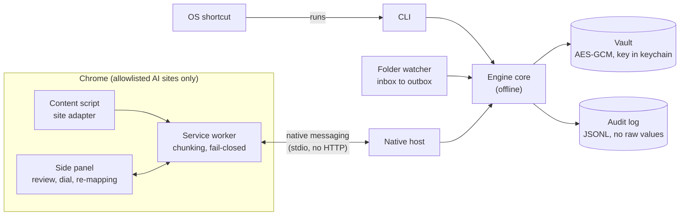
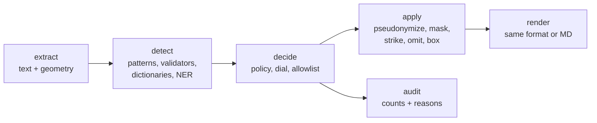

# Redactit: implementation plan

Redactit removes sensitive data from text, Markdown, DOCX, PDF and images **on the user's
machine** before any of it reaches an LLM chat (Claude, ChatGPT, Gemini). This document
fixes the stack, the file layout, the risks, and the order of delivery. It changes only
through a reviewed PR.

## 1. Scope

**In the MVP**

- Formats: plain text, Markdown, DOCX (to redacted Markdown), PDF (to image-only PDF plus
  Markdown), PNG/JPEG images.
- Interfaces: CLI, Chrome native-messaging host, folder watcher (`inbox/` to `outbox/`),
  clipboard redaction on an OS keyboard shortcut.
- Chrome MV3 extension with adapters for claude.ai and chatgpt.com, and a
  "Redact & copy" fallback that also covers gemini.google.com.
- Policy file, encrypted pseudonym vault, JSONL audit log, leak test, install scripts.
- English only.

**Not in the MVP**

| Item | Why deferred |
|---|---|
| Audio | Removed from scope. Also removes the only LGPL dependency (FFmpeg via PyAV). |
| Policy assistant | Online, admin-only config tool. Planned as Phase 8, after the MVP ships. |
| Full Gemini adapter | Gemini gets the fallback only; its UI changes often. |
| Pseudonyms shared across chats | Linking chats raises re-identification risk. |
| Remote log forwarding (SIEM) | Needs network egress; contradicts the offline engine. |
| Other browsers, other languages | Scope control. |

## 2. Architecture



Every interface calls the same pipeline. Format modules only extract and render; they
never decide what is sensitive.



Core types (in `types.py`):

- `Segment`: a run of text plus optional geometry (page, boxes per character or word).
- `Span`: `start`, `end`, `entity_type`, `score`, `detector`, `validated`.
- `Decision`: a `Span` plus `action`, `policy_rule_id`, and `reason`. The reason is built
  from the rule, detector, score and dial. It never contains matched text.

### 2.1 Folder watcher and clipboard shortcut

**`redactit watch`** (`hosts/watcher.py`) redacts every file dropped into an inbox into an
outbox, through the same per-file code and output names as `redactit redact`
(`cli.redact_file`). One engine, with text and OCR warmed, serves the whole run.

- Folders default to `inbox/` and `outbox/` in the user data folder. Only `--inbox` and
  `--outbox` move them, never the environment, and the outbox may not be the inbox. New
  folders are created private. Only the inbox's top level is watched.
- The inbox is only read. A file is read once its size and mtime have held for 2 s, so a
  file still being copied is not redacted half-written. Symlinks, junctions and mount
  points are skipped, never followed out of the inbox; other reparse points, such as
  OneDrive placeholders, are read as files.
- Two inputs whose outputs share a name (notes.docx and notes.docx.md, scan.pdf and
  scan.pdf.md) are never both written: the later one is skipped with a message. `redactit
  redact` does the same, and refuses an `--out` folder where an output would replace an
  input.
- Each version of a file is redacted once. While running, a fingerprint (file ID, size,
  mtime) tells a real change from a read. At start-up, a file whose outputs are all newer
  than it is skipped; "newer" also counts creation time (Windows) or inode change time,
  because a copy keeps the old mtime.
- Outputs are staged in a private folder inside the outbox and renamed into place, and
  the folder is removed however the watcher stops (THREAT_MODEL T11).
- Each file gets its own pseudonym scope unless `--scope` links them: a watcher runs for
  days, and its files go to different chats.
- A bad file logs its type and a reason, never its name or content, and is not retried
  until it changes. At most 64 MiB per file, as from the extension.
- Outputs are kept as long as the vault's entries, then deleted (§12): the policy's
  `vault.retention_days`, 30 days by default, so a shorter admin or user setting shortens
  both. `copies.py` records each one in `copies.json` in the user data folder, never in
  the outbox: its path, when it was written, and its file ID, size and mtime. A purge runs
  at start-up and about once an hour. It deletes a copy only if it is recorded, older than
  the retention period, still has the recorded file ID, size and mtime, and is a regular
  file, not a link (the same link rule
  as the inbox). The user's own files in the outbox were never recorded; a copy the user
  edited or replaced, a link, and anything in the current inbox are dropped from the index
  and left alone. The index is replaced by an atomic rename, and one that cannot be read
  deletes nothing. Each purge writes a `copies_purge` audit event of counts only.
- Copies expire only while a watcher runs: one never started again keeps its copies.
- An input left in the inbox is redacted again once its copies expire, at the next
  start-up, as one whose outputs the user deleted is. Originals are never touched: the
  inbox is only read, and the purge never deletes from it.

**`redactit clip`** (`hosts/clipboard.py`) runs once per keypress and never monitors.
It reads the clipboard's text, leaves an item a password manager marked concealed
untouched (without reading its text), redacts the text, and writes it back as plain
text only. The copying program's HTML and RTF copies were not checked, so they are
dropped. It prints one line of counts. Exit status: 0 written back; 3 nothing to redact
(no text, or concealed); 1 failed. In both non-zero cases the clipboard is untouched,
including when it changed while the engine ran, with one exception: Windows and macOS
must clear the clipboard before writing to it, so a write that fails after the clear
leaves it empty. It never holds the unredacted text after a failed run.

| OS | Concealed when | Read through |
|---|---|---|
| Windows | `ExcludeClipboardContentFromMonitorProcessing` or `Clipboard Viewer Ignore` is present, or `CanIncludeInClipboardHistory` is 0 | `ctypes` (Win32) |
| macOS | `org.nspasteboard.ConcealedType` is present | `pyobjc-framework-Cocoa` (NSPasteboard) |
| Linux | `x-kde-passwordManagerHint` is `secret`. GNOME and some Wayland compositors set nothing (THREAT_MODEL §5) | `wl-paste`/`wl-copy`, else `xclip`, as separate programs |

**Shortcut binding** (done by the Phase 7 installers). The shortcut runs `redactit clip`
through the same kind of launcher as the native host (§7), with no console window:

- **Windows:** a Start-menu shortcut (`.lnk`) with a hotkey such as Ctrl+Alt+R.
- **macOS:** a Quick Action that runs the launcher. The user assigns its key once in
  System Settings > Keyboard > Keyboard Shortcuts > Services; no supported API lets an
  installer do it (THREAT_MODEL §5). Phase 7 also checks whether macOS asks before a
  background process reads the pasteboard.
- **Linux:** a custom shortcut, set with `gsettings` on GNOME or `kwriteconfig` on KDE;
  elsewhere the installer prints the command to bind.

A shortcut has no terminal, so Phase 7 also decides how the one-line result is shown
(for example, a notification driven by the exit status). Each press starts a new process
and pays the full cold start, about 6 s (§10, risk 13).

## 3. Stack

Runtime dependencies must be MIT, Apache-2.0 or BSD. Exceptions are listed in section 8.

| Concern | Choice | License | Why this one |
|---|---|---|---|
| Language | Python 3.12, `uv` for envs | PSF / MIT | Required by the brief; `uv` gives a lockfile. |
| Detection framework | Presidio analyzer + anonymizer | MIT | Recognizer registry, context scoring and operators already exist. |
| NER | GLiNER with a PII-tuned checkpoint | Apache-2.0 (package) | See 3.1. |
| NLP engine for Presidio | spaCy `en_core_web_sm` | MIT | Tokens and lemmas only, through Presidio's slim engine (no parser, no spaCy NER, never downloads); GLiNER does the entity work. |
| Validators, secrets | In-house (Luhn, IBAN mod-97, SIN, SSN, NINO, key formats) | n/a | Each is under 20 lines. `python-stdnum` is LGPL, so it is excluded. |
| PDF | `pypdfium2` | Apache-2.0 / BSD-3 | Text with character boxes plus page rendering. PyMuPDF is AGPL, so it is excluded. |
| PDF rebuild | `pypdfium2`: a new document of JPEG page images | Apache-2.0 / BSD-3 | Writes raster pages only, never a text layer. `img2pdf` is LGPL, so it is excluded. |
| OCR | RapidOCR on `onnxruntime` | Apache-2.0 / MIT | Installs with pip, word boxes; its bundled ONNX files are pinned by SHA-256. |
| Faces | OpenCV YuNet (`opencv-python-headless`) | Apache-2.0 | Small, CPU-fast, returns boxes. |
| QR / barcodes | `zxing-cpp` | Apache-2.0 | Detects and locates many symbologies. `pyzbar` needs `zbar` (LGPL). |
| DOCX | `zipfile` + `defusedxml` walk of the OOXML parts | PSF (flagged) | Blocks XML entity attacks. `python-docx` does not expose comments or tracked changes well. |
| Vault | `cryptography` AES-256-GCM, `sqlite3`, `keyring` | Apache-2.0 / BSD, MIT | Key lives in the OS keychain, never on disk. |
| Policy | `PyYAML` `safe_load` + `pydantic` | MIT | Typed, validated config with clear errors. |
| CLI | `argparse` | PSF | Standard library, one less dependency. |
| Folder watcher | `watchdog` | Apache-2.0 | Cross-platform file events. |
| Clipboard | `ctypes` (Windows), `pyobjc-framework-Cocoa` (macOS only, by an environment marker), `wl-paste`/`xclip` (Linux) | PSF / MIT / external process | Reads the "concealed" markers that password managers set. |
| Tests | `pytest`, `pytest-socket`, `Faker` | MIT | `pytest-socket` makes any network call fail the test. |
| Test corpus | `reportlab` (digital PDFs), `Faker` | BSD / MIT | Builds the synthetic corpus. Test-only. The verifier reuses the runtime PDF, OCR, barcode and face libraries with its own settings. |
| Build backend | `hatchling` | MIT | Standard PEP 517 backend for `uv`. |
| Extension | MV3, plain JavaScript + JSDoc, no build step | n/a | What Chrome loads is exactly what is reviewed. |

### 3.1 NER choice: Presidio + GLiNER

The acceptance bar is zero surviving seeded values, so recall matters more than speed.

- spaCy's general NER is trained on news text. It misses unusual names and does not
  know PII-specific labels such as passport numbers or account IDs.
- GLiNER is a compact bidirectional transformer that matches spans against label
  descriptions at inference time. PII-tuned checkpoints cover names, addresses, dates of
  birth, IDs and more, and new labels need no retraining.
- Presidio wraps GLiNER as one recognizer among many. Validated patterns (cards, IBAN,
  national IDs) never depend on the model at all.
- Cost: GLiNER is slower on CPU than spaCy and adds a model of a few hundred MB. That is
  acceptable for paste-sized inputs. Large PDFs are processed per page.

**Checkpoint:** `knowledgator/gliner-pii-base-v1.0` (Apache-2.0, English-tuned, 60+ PII
labels, ships ONNX weights). `knowledgator/gliner-pii-edge-v1.0` is the lighter fallback
if shortcut latency is too high. `nvidia/gliner-PII` is excluded because it uses a custom
license. The model runs outside Presidio (see the decision below); its spans join the
Presidio pattern spans before the policy decides. Revision and SHA-256 are pinned in
`src/redactit/models.lock.json`.

**Decided in Phase 2:** the `gliner` package (and its `torch` dependency, whose bundled
MKL license was unverified) is not used. `detect/ner.py` runs the full-precision ONNX
export directly on `onnxruntime` with `tokenizers` in about 60 lines. The quantised export
was rejected: it scored 4 of 15 synthetic addresses below the default threshold.

## 4. File layout

```text
Redactit/
├─ pyproject.toml            # deps, entry point `redactit`
├─ uv.lock
├─ src/redactit/models.lock.json  # SHA-256 per model: URL at a pinned revision, or file inside a package
├─ src/redactit/policy.default.yaml  # annotated default policy, the base layer
├─ src/redactit/
│  ├─ cli.py                 # redact, verify, clip, watch, setup-models, host
│  ├─ types.py               # Segment, Span, Decision
│  ├─ pipeline.py            # extract -> detect -> decide -> apply -> render
│  ├─ policy.py              # schema, managed + user layering, dial thresholds
│  ├─ pseudonym.py           # [TYPE_N] allocation per chat scope
│  ├─ vault.py               # encrypted mapping store, 30-day purge
│  ├─ copies.py              # index of the watcher's redacted copies, purged with the vault's retention
│  ├─ audit.py               # JSONL writer, sanitised reasons only
│  ├─ safety.py              # blocks IP sockets and DNS inside the engine
│  ├─ managed.py             # OS-derived admin policy path, admin-ownership check
│  ├─ models.py              # load-time SHA-256 verification, files held until loaded
│  ├─ detect/
│  │  ├─ patterns.py         # regexes + validators (Luhn, IBAN, SIN, SSN, NINO)
│  │  ├─ secrets.py          # API key and token formats, PEM blocks, JWTs
│  │  ├─ dictionary.py       # company terms, allowlist
│  │  └─ ner.py              # GLiNER on onnxruntime, token-budget windows
│  ├─ formats/
│  │  ├─ text.py             # .txt / .md
│  │  ├─ docx.py             # body, headers, footers, notes, comments, revisions
│  │  ├─ pdf.py              # text layer + raster pipeline, rebuild
│  │  └─ image.py            # OCR + faces + codes, fill, re-encode
│  ├─ ocr.py                 # RapidOCR wrapper shared by pdf and image
│  └─ hosts/
│     ├─ native.py           # native messaging: framing, chunking, queue, warm-up, origin check
│     ├─ watcher.py          # inbox -> outbox
│     └─ clipboard.py        # read, skip concealed, redact, write back
├─ extension/
│  ├─ manifest.json          # fixed `key` so the extension ID is stable
│  ├─ background.js          # native port, chunk reassembly, fail-closed
│  ├─ content/
│  │  ├─ intercept.js        # paste, drop, file input (shared)
│  │  └─ adapters/           # claude.js, chatgpt.js, gemini.js (one file per site)
│  └─ sidepanel/             # panel.html, panel.js, panel.css
├─ installers/
│  ├─ install.ps1            # Windows: venv, models, host registry key, shortcut
│  ├─ install.sh             # macOS + Linux
│  └─ host-manifest.json     # template; allowed_origins = our extension ID only
├─ tests/
│  ├─ corpus/                # generate.py + corpus_docx.py, corpus_media.py: seeded corpus
│  ├─ leak/run.py            # re-extract, re-OCR, score, write report
│  ├─ unit/                  # per module
│  ├─ test_offline.py        # engine run with sockets disabled
│  ├─ test_host.py           # native host round trips in Chrome's frames (hostkit.py starts it)
│  ├─ e2e/                   # the extension in Chromium (Playwright): stand-in site, fake hosts
│  ├─ test_watch.py          # folder watcher round trip; `redactit watch` stopped from the keyboard
│  ├─ test_clip.py           # `redactit clip` on the real clipboard (skipped without one)
│  ├─ test_licenses.py       # fails on any non-permissive dependency
│  └─ test_leak_harness.py   # harness must see every value on unredacted input
├─ docs/
│  ├─ PLAN.md
│  ├─ THREAT_MODEL.md
│  └─ leak-reports/          # full leak report per phase
└─ .github/
   ├─ workflows/ci.yml       # Win/macOS/Linux: unit + text leak test + license check; Linux: e2e
   └─ pull_request_template.md
```

Generated corpora, leak outputs and models are git-ignored. Only generators and reports
are committed.

## 5. Per-format design

| Format | Extract | Apply | Output |
|---|---|---|---|
| Text / MD | Whole file as one segment; Markdown syntax untouched | String replacement by span | Same format |
| DOCX | Walk `document.xml`, `header*.xml`, `footer*.xml`, `footnotes.xml`, `endnotes.xml`, `comments.xml`; include `w:ins` and `w:del` runs; comment and revision authors are names; text in any other part (text boxes, charts, SmartArt, custom XML). No DTDs; at most 2000 parts and 200 MiB of XML | Replace in extracted text | `name.docx.md` with sections: Body, Headers and footers, Notes, Comments, Tracked changes, Authors, Other text. `docProps` metadata is dropped |
| PDF | Per page: text and character boxes from `pypdfium2`, placed on the rendered page through PDFium so rotated and cropped pages line up. Every page is also rendered at 200 DPI and sent through the image pipeline, which catches scanned pages, text inside embedded images, and outlined fonts. At most 500 pages and 64 MP per page | Spans map to character boxes, merged per line and padded; image-pipeline boxes are unioned in; boxes are filled and labelled `[PERSON_1]` when the action is pseudonymize | New PDF built only from the page images (no text layer, no metadata), plus `name.pdf.md` from OCR of the visible page, so text hidden under a drawn box never reaches it; OCR text under a text-layer box is masked first, so the Markdown hides whatever the page hides |
| Image | PNG, JPEG, WebP, BMP, GIF, TIFF only, at most 50 MP. OCR at full size (tiles past 4096 px), YuNet faces, zxing codes (always filled; the payload is not read) | Fill boxes on a copy of the pixels | Re-encoded from raw pixels, so EXIF and GPS never carry over; JPEG stays JPEG, the rest become PNG |

## 6. Policy, dial and pseudonyms

- **Layers.** Built-in defaults (`policy.default.yaml`), overridden by the admin's managed
  policy, then merged with the user policy. The managed path comes from the OS
  (`C:\ProgramData\Redactit\policy.yaml` via the known-folder API, `/etc/redactit`,
  `/Library/Application Support/Redactit`), never from environment variables, and a file
  the current user owns is refused. The user merge is **tighten-only**: a user can raise
  the dial, add terms, or enable types, but cannot go below the admin floor, unlock locked
  types, or allowlist values (only the admin can).
- **Per-site rules.** `sites.<host>.dial` raises the dial for one AI site (e.g. chatgpt.com
  at 4); it can never lower it.
- **Dial 1 to 5.** Maps to a per-entity-type score threshold. The default is 3, and so
  is the default admin floor: it is the lowest dial the leak test proves, so a user
  cannot go below it unless an admin lowers the floor. Contact details sit 0.05 lower;
  names and addresses from the model sit 0.15 lower, because its probabilities run lower
  than pattern scores for the same certainty.
- **Locked types** (cards, IBAN, API keys, SIN, SSN, NINO, passport numbers) are
  validator-driven and apply at every dial position.
- **Review mode** `always` or `low_confidence_only`. A review that times out blocks the
  send; it never passes content through unredacted.
- **Pseudonyms** `[PERSON_1]` are allocated per chat scope. The extension derives the
  scope from the chat URL. A brand-new chat uses a temporary scope, which the chat keeps
  once the site assigns its ID, and which never goes to any other chat (§7). Vault entries
  purge after 30 days.
- **Re-mapping** of pseudonyms back to real names happens only inside the side panel,
  which is an extension page. Real names are never written into the AI site's DOM, where
  the site's scripts could read them. The panel sends the AI's reply through the service
  worker (`redactit/remap`, extension pages only) to the host (`remap`, protocol 2), which
  replaces each of that chat scope's labels with its value from the vault and leaves any
  other `[TYPE_N]` alone. The worker uses the same scope as the tab's redactions. The audit
  log records counts per type, never values.

## 7. Extension

- Permissions: `nativeMessaging`, `storage`, `sidePanel`. Host permissions:
  `https://claude.ai/*`, `https://chatgpt.com/*`, `https://gemini.google.com/*`.
  No `<all_urls>`, no remote code, no `eval`, no `content_security_policy` key (Chrome's
  default MV3 policy applies). Plain JS with JSDoc, no build step. `tests/unit/test_extension.py`
  enforces all of this without a browser.
- Extension ID: the manifest's `key` is the public half of a development key pair, so the
  unpacked extension's ID is always `ejcaindhhnocdeolkgmcfnbemobjhllk`, the ID the
  installer writes into the host manifest's `allowed_origins`. The private half is not in
  the repo (`*.pem` is ignored); it is needed only to pack a `.crx` with the same ID. The
  Chrome Web Store assigns its own key and ID at the first upload: from then on the
  manifest carries the store's public key, and `allowed_origins` follows the store's ID.
- Interception (`content/intercept.js`): capture-phase `paste`, `drop` and file-input
  `input`/`change` listeners on `window`, registered at `document_start` in every frame, so
  they run before any site listener. Only trusted events are taken (a page's own synthetic
  events carry data it already has). The original event is cancelled, or the picked
  files are taken out of the input, and the payload goes to the engine. The result goes
  back as a synthetic event of the same kind carrying only redacted data, which a site's
  editor handles like the user's; if the site ignores it, the text is inserted into the
  field (`setRangeText`, or `insertText` in a contenteditable) and files are put in the
  site's file input. Files come back under neutral names (`redacted-N.ext`), because a
  file name can identify someone and the engine does not check names. A PDF goes back as
  its redacted PDF; its Markdown is not attached. File types the engine cannot check (SVG,
  archives, spreadsheets) are blocked. A drag that starts inside the page is left alone.
- Fail closed: a host that is not installed, exits, sends nothing for 2 minutes (10 for
  files, whose single OCR step reports no progress), breaks the protocol, or reports an
  error blocks the paste or upload, with an in-page notice that says why. Nothing is
  handed to the page until the whole result is in and checked. The service worker's
  message API, used by the content scripts and the side panel, is documented at the top
  of `background.js`.
- Chunking: Chrome caps host-to-extension messages at 1 MB and extension-to-host messages
  at 64 MiB. Both directions use the same numbered-frame protocol (frames of 512 KiB),
  so one code path covers both. The protocol is specified in `hosts/native.py`:
  - a payload travels as base64 chunks of 384 KiB (512 KiB of base64), numbered from 0,
    with a total that must follow from the declared size;
  - a strict schema: unknown types or fields are refused, and errors carry a stable code
    and never the input;
  - caps: 64 MiB per paste or file (Chrome's own per-message cap the other way; pastes get
    no smaller cap), 16 requests and 128 MiB in flight;
  - requests queue in arrival order, report progress (page N of M for PDFs), and can be
    cancelled.
- Warm host (speed plan decision 1): the host announces `warming`, then `ready-text` once
  text detection loads (OCR keeps warming in the background), then `ready-all`. A request
  that arrives while warming waits; it is never dropped. The host exits after 30 idle
  minutes and checks the caller's origin against its installed manifest.
- Starting the host: the service worker connects on the first paste, drop or file pick,
  or when an AI site loads if the user turned on "Keep Redactit ready" (`keepReady` in
  `chrome.storage.local`, off by default). A request that arrives while the host warms
  up is sent at once, held, and blocked if the host cannot serve it within 30 s. After an
  unexpected disconnect the worker reconnects (backing off from 1 s to 60 s) only with
  Keep Redactit ready on, and never after the host's own idle exit; otherwise the next
  paste starts it. A host whose engine could not start is restarted by the next request.
- Pseudonym scope: the chat's ID from its URL (`claude.ai/chat/<id>`, `chatgpt.com/c/<id>`,
  `gemini.google.com/app/<id>`). A new chat gets a temporary scope for its tab. The worker
  follows each tab's URL on the three sites (`tabs.onUpdated`, and every request), and only
  the step from a new chat straight to a chat ID never used before gives that chat the
  temporary scope, so `[PERSON_1]` still means the same person once the site has assigned
  the ID. A tab that opens a chat already in use, or any other step, leaves the new chat's
  scope behind: an older chat never takes labels that mean other people there. The chats
  and their scopes are kept in `chrome.storage.local`, so they outlive a browser restart
  and an extension update (the 5,000 most recent chats); each tab's place and temporary
  scope in `chrome.storage.session`. Both hold URL paths and generated IDs only, never
  content (`tests/e2e/test_scopes.py`).
- Host launch (built in Phase 7): the manifest's `path` is a small launcher the installer
  writes. It starts the base interpreter directly, because the venv's launcher costs 1.37 s
  against 0.3-1.1 s for base Python:
  `<base python> -I -S -c "import site, sys; site.addsitedir(r'<venv site-packages>');
  from redactit.hosts.native import main; main()" --manifest <installed manifest> <args>`,
  as a `.cmd` file on Windows and a `/bin/sh` script elsewhere. `-I` ignores `PYTHON*`
  variables and the user site; `-S` keeps the base interpreter's own packages off the path,
  so only the venv's pinned packages load. `tests/test_host.py` starts the host this way.
- Review UX: `chrome.sidePanel.open()` only works synchronously inside a user gesture in
  extension code (Chrome 116+). When a paste needs review, the send is held and an
  in-page notice asks the user to click the Redactit toolbar button, which opens the panel
  with the pending review. The review mode is the policy's (`review.mode`), which the
  host reports in its status (protocol 2: `always` or `low_confidence`); it is not an
  extension setting, so a user cannot switch off a review the admin asked for. Every
  result carries `review: {needed, count}`, the number of the engine's decisions marked
  for review, counts only. A page's result is held when the mode is `always`, or
  `low_confidence` with `needed`; never when it is `off`; and, until the host has said,
  as if `always`. Only extension pages can read or decide a review, so a site cannot
  approve its own paste; a review not decided in 10 minutes blocks. The worker refuses a
  host on another protocol version (`host_incompatible`).
- Side panel (`sidepanel/`, plain ES modules, no build step): an extension page, so the
  only place real values may appear (THREAT_MODEL T6). It works for the chat in view: the
  active tab of its window, whose site and chat set the rules and the pseudonym scope
  (`tabId` in the worker's API); opened as a tab of its own, the chat tab used last.
  - Drop zone: the approved face design. A file dropped or picked on the right folder goes
    through the job port in the host's chunk framing; the right folder drains, the left
    fills with the redacted copy, and the smile shows the percentage. Progress moves only
    on real milestones (upload, `queued`, `redacting`, PDF page N of M, the result's
    chunks); a stage with no finer report holds its level while the divider's dots move,
    beside an elapsed clock. Held (warming, review), blocked (the worker's fixed reason)
    and cancel are shown. One file at a time; the copy gets a neutral name
    (`redacted-N.ext`).
  - Getting the copy out: Attach to chat asks the worker to hand the copy it checked to
    the tab's composer, naming only the job (`redactit/attach {job, tabId}`). The worker
    keeps the panel's last finished file in memory for 10 minutes, until it is attached,
    or until the panel starts another file, and only for the tab and chat it was redacted
    for, whose pseudonym labels it carries. The tab's content script inserts the file part
    as a redacted drop (composer, else file input) and refuses without a working adapter
    (`insert_failed`); other refusals are `expired`, `not_allowed_site`, and
    `too_large_to_attach` for a copy over 48 MiB, the most one message to the tab carries,
    checked before anything else is done with it, whose reason says to download it. The policy's
    review applies here as to a page's paste: a copy it would hold (`always`, or
    `low_confidence` with decisions marked) is refused with `review_required` until the
    panel has shown it (the text, the image, or the PDF itself and its page text) and the
    user has pressed Approve, which sends `approve: true`. Dragging the left folder carries only
    `DownloadURL`, which saves the copy where it is dropped outside the browser: Chromium
    does not carry a File made in a page to another page (it arrives as its name in
    `text/plain`, which a chat would paste; recorded in `tests/e2e/test_panel.py`).
    Download is a blob-URL link. Text results, and a PDF's page text, can be copied.
  - Redact & copy (`redactit/redact-text`) copies only the redacted text.
  - Status pill and the chat in view from the events port; "Keep Redactit ready" writes
    `keepReady`; the review mode is shown read-only, `Not known yet` until the host's
    policy loads, an unknown mode as off.
  - Review queue: each held item with what and where it is, why it is held
    (`always` or `low_confidence`), the time left and its redacted content, the very
    bytes Approve hands over (`redactit/review-get`, extension pages only): text as text,
    an image as the image, a PDF as the PDF itself, opened from the panel in the
    browser's viewer, beside its page text. Approve is enabled only once all of it is
    shown; a file too large for one message (48 MiB) cannot be approved. Approve or Cancel.
  - Re-mapping (`redactit/remap`): a pasted reply is shown with real values, as text in
    the panel's DOM only. Never stored, never sent to a tab, never copied by itself:
    copying takes its own click beside a warning that the text holds real data, and the
    view clears when the chat in view changes.
  - Keyboard operable with visible focus, a polite live region, `prefers-reduced-motion`
    (levels step, dots stop), 320 to 500 px wide, light and dark from
    `prefers-color-scheme`. System fonts; icons are cloned from templates, so no markup is
    built from strings.
- In-page notices live in a closed shadow root: the site can tell that one exists, but
  cannot read it. They show status and reasons only, never content.
- Main-world guard (`content/guard.js`): the one script that runs in the page's own world,
  at `document_start` on the three sites, before their scripts. It makes the site's own
  clipboard reads and file pickers reject with `NotAllowedError`, locked against being
  reassigned or deleted, so a site uses paste and the file input, which are intercepted.
  What a determined page can still do is in THREAT_MODEL §5.
- Adapters (`content/adapters/claude.js`, `chatgpt.js`, `gemini.js`): one file per site,
  isolated, naming only the composer and the file input. Each adapter self-checks its
  selectors for 15 s after load and disables itself (fallback only) if they are missing;
  the generic interception still cancels, redacts or blocks. The selectors were written
  from public descriptions of the sites and are **unverified** until the owner's manual
  check on the live sites (Phase 5 done-when).
- Browser tests (`tests/e2e/`, Playwright): Chromium in the new headless mode runs the
  unpacked extension, with only the host name and test timeouts rewritten in its copy.
  Playwright answers every request, serving stand-in chat pages at the real site URLs, so
  the shipped manifest is what is tested and nothing reaches the network. The test host is
  registered in the browser's own profile on Linux and macOS; on Windows Chromium reads
  only `HKCU\Software\Chromium\NativeMessagingHosts`, so those tests run only with
  `REDACTIT_E2E_REGISTRY=1` and always delete the key. CI runs them on Linux. The side
  panel's tests put a scripted host (`tests/e2e/stubhost.js`, protocol 2) behind the
  worker's `connectNative`, so the worker's own framing, holds, review and checks run on
  every OS with no host registered; one panel test drops a PDF through the real host.
  Where Playwright's Chromium cannot start, `REDACTIT_E2E_CHROMIUM` names another
  Chromium build (Microsoft Edge runs the unpacked extension).

## 8. Security rules and license exceptions

- No raw content in logs, exceptions or audit entries. A logging filter and a sanitised
  exception type enforce it; the leak test also scans logs and the audit file.
- No telemetry of any kind.
- Temporary files go in a private directory (`0700` on POSIX, user-only ACL on Windows),
  deleted in `finally`. In-memory processing is the default. The folder watcher is the
  only writer of temporary files: its private folder sits inside the outbox, so the final
  rename stays on one volume and is atomic. On Windows that ACL needs Python 3.12.4 or
  later, which the watcher checks. The index of its copies is replaced the same way,
  through a temp file beside it in the user data folder (0600 on POSIX).
- Models are downloaded once by `redactit setup-models`, pinned by SHA-256, and verified at
  every load, with no hash cache. RapidOCR's three ONNX files ship inside its package and
  are pinned too; setup checks them and never downloads them. The hash runs in a thread
  while the imports do. Until a model is loaded, Windows holds it open against writes,
  renames and deletes; elsewhere it is hashed again after loading and refused if it
  changed. At runtime the engine blocks every non-Unix socket and every DNS lookup in its
  own process, so no dependency can phone home.
- CI runs a license check that fails on anything outside MIT, Apache or BSD unless it is
  listed here.
- Synthetic data only. Real documents are never committed.

**Flagged exceptions** (permissive, but not literally MIT, Apache or BSD):

| Dependency | License | Why accepted |
|---|---|---|
| Pillow | MIT-CMU (historical PIL license) | Permissive, MIT-equivalent terms; the only mature raster PDF writer without LGPL |
| defusedxml | PSF-2.0 | Permissive; the standard defence against XML entity attacks in untrusted DOCX |
| torch (only if option (a) in 3.1 is chosen) | BSD-3 plus bundled libraries | Bundled Intel MKL license is **unverified**; must be checked before it is accepted |
| pypdfium2 | BSD-3 / Apache-2.0; bundled PDFium notices mention GPL | Mentions are ICU's autoconf macros (GPL with the Autoconf exception, build scripts only) and the LLVM exception clause; no copyleft code in the binary |
| OpenCV wheels (runtime from Phase 3: RapidOCR, YuNet) | Apache-2.0, but every wheel bundles FFmpeg (LGPL-2.1) as a separate DLL | **Accepted by the owner (option A).** LGPL permits unmodified dynamic use in closed or open products; `THIRD_PARTY_NOTICES.md` carries the license texts and the exact source links. Before a commercial release, a lawyer should check codec patents in the bundled FFmpeg (Redactit never decodes video). Fallbacks if needed: OpenCV built without FFmpeg, or Tesseract. |

Runtime exceptions accepted by the owner (used unmodified; obligations attach only to
changes in their own files): certifi (MPL-2.0, via requests/httpx), setuptools (MIT, vendoring
LGPL-3 and MPL-2.0 files, required by spaCy), typing-extensions (PSF-2.0).

Also shipped from Phase 3 via `rapidocr-onnxruntime`, enforced in `tests/test_licenses.py`:
numpy (BSD/MIT/Zlib/CC0 plus the GCC runtime exception), tqdm (MPL-2.0 AND MIT), shapely
(bundled GEOS, LGPL-2.1).

Excluded after checking: PyMuPDF and Ghostscript (AGPL), `img2pdf` (LGPL-3), `python-stdnum`
(LGPL-2.1+), `zbar` behind `pyzbar` (LGPL-2.1), PyAV (removed with audio).
Linux clipboard access calls `wl-paste`/`xclip` as external processes; they are not
linked into Redactit.

## 9. Leak test (acceptance)

1. `tests/corpus/generate.py --seed N` writes documents in every format, with the seeded
   values recorded in a manifest. It includes hard cases: values split across lines, cards
   with spaces or dashes, PII in DOCX headers, comments and deleted revisions, text inside
   images embedded in PDFs, rotated and cropped PDF pages, low-contrast and rotated text,
   small text in a 4K screenshot, faces, and QR codes that encode PII. Every corpus also
   holds 48 rotated stress pages (one value at 90, 180 or 270 degrees, 14-32 px, black or
   grey) and a scanned page whose only text runs sideways, which probe the OCR gate.
2. Redact the corpus at the admin floor and at the tightest dial.
3. Verify each output **independently of the redactor**. Correlated errors would hide
   leaks, so the verifier uses higher-resolution rendering (300 DPI) and its own OCR
   settings (full size up to 8192 px, three rotations). It
   also compares normalised forms (digits only for numbers, case-folded names, edit
   distance of 1 or less).
   - PDF: re-extract the text layer (expected empty) and re-OCR every page.
   - Images: re-OCR, re-scan codes, re-run face detection, check that no EXIF is present.
   - DOCX, text: re-run detection on the Markdown output.
   - All formats: raw byte search of every output, the audit log, and application logs.
4. Report recall (seeded values removed divided by seeded values) and precision (redacted
   spans that overlap a seeded value divided by all redacted spans) per format and entity
   type.

**Pass condition:** zero seeded values survive in any format at dial 3 and at the admin
floor. Precision is reported, not gated.

## 10. Risks

| # | Risk | Mitigation |
|---|---|---|
| 1 | NER misses an unusual name and it leaks | GLiNER + dictionaries + dial; hard names in the corpus; low-confidence review |
| 2 | Verifier shares the redactor's blind spots | Independent verifier settings and fuzzy matching; byte-level search |
| 3 | A site's UI change breaks an adapter | Selector self-check, fallback mode, fail closed |
| 4 | A site script reads the paste before we do | Capture-phase listeners at `document_start`; tested per adapter |
| 5 | Native messaging size limits | Framed chunking both directions; tested with multi-MB PDFs |
| 6 | Another extension or process talks to the host | `allowed_origins` lists one fixed extension ID; host checks the caller origin |
| 7 | A user edits the policy to weaken it | Managed layer + tighten-only merge |
| 8 | Context re-identifies a pseudonym ("the CEO of [ORG_1]") | Documented residual risk; out of scope for the MVP |
| 9 | OCR misses small, rotated or low-contrast text | 200 DPI raster, full-size reads, four quarter turns (RapidOCR's own classifier only knows 180 degrees; the three turned reads are skipped only when the upright read left no box unread, never at dial 5), a 2x pass for small images, padded boxes, corpus hard cases |
| 10 | Slow redaction breaks the chat flow (measured: 6.1 s cold start, about 11 s per PDF page, 9.5 s per 1080p screenshot) | Warm host, faster OCR and visible progress; see docs/perf/speed-plan.md (approved) |
| 11 | OS keychain unavailable (headless Linux) | Fail closed with a clear setup message |
| 12 | Face test images must be synthetic and license-clean | Public-domain AI-generated portraits; sources in `tests/fixtures/faces/SOURCES.md` |
| 13 | Every clipboard shortcut press pays the full cold start (about 6 s), because `redactit clip` is a new process that loads and verifies the models each time | Accepted for now and documented in §2.1. A later phase lets `clip` hand its text to an engine that is already running instead of loading its own. Not built yet. |

## 11. Delivery

Each phase ships as one PR with small commits grouped by concern, screenshots where the
change is visual, and the leak report attached. Nothing merges without owner approval.

| Phase | Deliverable | Done when |
|---|---|---|
| 0 | This plan | Approved |
| 1 | Package scaffold, CI, corpus generator, leak-test harness, offline test, `THREAT_MODEL.md` | Harness runs end to end on a pass-through redactor and reports 0% recall, which proves it can detect leaks |
| 2 | Text engine: patterns, validators, secrets, dictionaries, GLiNER, policy + dial, pseudonyms, vault, audit, CLI | Text/MD leak test passes; offline test passes |
| 3 | DOCX, PDF, images | Leak test passes for all MVP formats |
| 4 | Native host, folder watcher, clipboard shortcut | Round-trip tests per interface; concealed items skipped |
| 5 | Extension: claude.ai + chatgpt.com adapters, side panel, re-mapping, fallback | Manual script on both sites with synthetic data; fail-closed demo |
| 6 | Audio | Removed from scope |
| 7 | Audit log review, installers (Windows, macOS, Linux), README with a 3-minute demo | Fresh-machine install works on all three |
| 8 | Policy assistant (after the MVP) | Separate plan |

**Review checklist** (in the PR template):

1. Safe: leak test, offline test, license check, no raw values in logs?
2. Enough: does it meet the phase's done-when row?
3. Required: does every file trace to this plan?
4. Shortest: is anything unnecessary?
5. Documented: does every non-obvious rule have a comment explaining why?
6. Reviewable: one concern per commit, with the reason in the commit body?

## 12. Open questions

None are open.

Settled:

- **Face fixtures**, in Phase 3 (risk 12).
- **Outbox retention**, on 2026-10-02. The owner chose 30 days, as for the pseudonym
  vault: the folder watcher deletes its redacted copies after the policy's
  `vault.retention_days`, whose default is 30 (§2.1).
- **Low-confidence review**, on 2026-10-02. The host's results gain a flag for
  low-confidence spans (a protocol version bump on both sides), and the review mode comes
  from the policy rather than an extension setting.
