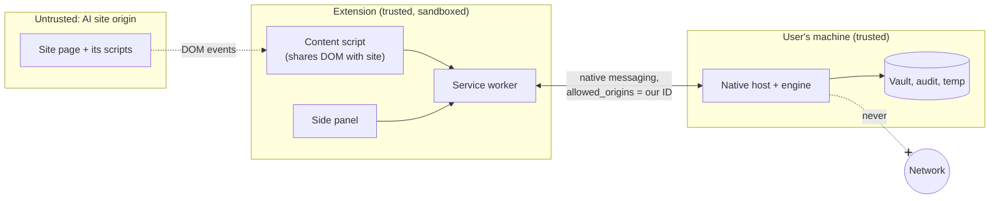

# Redactit threat model

What Redactit protects, from whom, where the trust boundaries are, and which control
covers each threat. Each control names the test or design section that enforces it.
Update this file in the same PR as any change that moves a boundary.

## 1. Assets

| Asset | Where it lives | Why it matters |
|---|---|---|
| Original content (text, files, clipboard) | User's machine, engine memory, temp dir while processing | The thing we exist to keep away from LLM providers |
| Pseudonym mappings (`[PERSON_1]` to real value) | Encrypted vault on disk | Reverses the redaction for anyone who reads it |
| Vault key | OS keychain | Decrypts the vault |
| Policy (managed + user) | `policy.yaml` files | Weakening it silently lets data through |
| Audit log | JSONL on disk | Must prove what happened without itself leaking values |
| Models | Local files pinned by SHA-256 | A swapped model can miss entities on purpose |

## 2. Trust boundaries

- **B1, site page to content script.** The content script shares the DOM with code we do
  not control. Anything written into the page can be read by the site.
- **B2, extension to native host.** Chrome only launches the host for origins listed in the
  host manifest. That list contains exactly one extension ID. The host checks the origin
  Chrome passes against the same installed manifest, never the environment, so a process
  that starts the host itself with another origin is refused before the engine loads.
- **B3, engine to disk.** Temp files, the vault and logs are readable by other processes
  running as the same OS user.
- **B4, engine to network.** There is no such path. The engine makes no network calls at
  runtime, and models are fetched only by the setup command.

## 3. Adversaries

| Adversary | Capability | In scope |
|---|---|---|
| LLM provider or site script | Reads anything in the page DOM and anything sent to its servers | Yes, the primary adversary |
| Another extension | Can try to message our host or read the page | Yes |
| Malware running as the same OS user | Reads files, keychain entries, memory | No. Out of scope: it can read the originals directly |
| The user trying to bypass policy | Edits user files, turns the dial down | Yes, up to the admin floor |
| Supply chain (a dependency or model) | Ships malicious code or weights | Partly: pins, hashes, license review; not full code audit |

## 4. Threats and controls

| # | Threat | Boundary | Control | Enforced by |
|---|---|---|---|---|
| T1 | A seeded value survives redaction (missed detection) | Engine | Validators + dictionaries + GLiNER + dial; review for low confidence | Leak test: zero survivors from the admin floor (dial 3) to dial 5 |
| T2 | Text survives in a PDF layer, metadata or embedded image | Engine | Pages rebuilt from images only; every page also goes through the image pipeline | Leak test: re-extract text layer, 300 DPI re-OCR, raw byte search |
| T3 | EXIF/GPS or text chunks survive in an image | Engine | Re-encode from raw pixels | Leak test: metadata dump and byte search |
| T4 | DOCX comments, tracked deletions, headers or `docProps` leak | Engine | All OOXML parts walked; `docProps` dropped from output | Leak test DOCX variants |
| T5 | The site reads a paste before we redact it | B1 | Capture-phase listeners registered at `document_start`; event cancelled before the site sees it | Per-adapter interception test (Phase 5) |
| T6 | Re-mapped real names are exposed to the site | B1 | Re-mapping only inside the side panel (an extension page); never written to the site DOM | Design rule, PLAN §6; review check in Phase 5 |
| T7 | Upload proceeds while the engine is down | B1/B2 | Fail closed: disconnect, timeout or error blocks the upload | Extension test with the host stopped (Phase 5) |
| T8 | Another extension or process drives the native host | B2 | `allowed_origins` with one fixed ID; host also checks the origin argument Chrome passes against the installed manifest | `tests/test_host.py`: a wrong origin and the unfilled template are refused before the engine loads; `tests/unit/test_native.py`: the manifest must allow exactly one well-formed ID. Registration itself: installer test (Phase 7) |
| T9 | Oversized or malformed native messages crash the host or truncate data | B2 | Length-prefixed frames, 512 KiB chunks with checked sequence numbers and totals, strict JSON schema, caps per message, payload and in-flight requests | `tests/unit/test_native.py` (schema, reassembly); `tests/test_host.py` (bad length, bad JSON, oversized message, wrong sequence number, unknown type, caps; a multi-MB PDF and image byte-identical to the engine's output) |
| T10 | Raw values end up in logs, exceptions or the audit file | B3 | Audit stores types, counts, rule IDs and scores only; logging filter; sanitised exception type; the native host's errors are fixed text and library output on its stderr is withheld | Leak test scans logs and audit file (Phase 2); `tests/test_host.py` checks the host's errors, stderr and audit file |
| T11 | Temp files are left behind or readable by others | B3 | Private dir (0700 or user-only ACL), deleted in `finally`; memory by default | Formats and the native host work in memory and write no temp files; the test lands with the first that does (Phase 4 folder watcher) |
| T12 | Vault read from disk | B3 | AES-256-GCM, key in OS keychain, 30-day purge | Vault unit tests (Phase 2) |
| T13 | User weakens the policy | Engine | Managed layer, tighten-only merge, locked types | Policy merge tests (Phase 2) |
| T14 | Engine phones home or downloads at runtime | B4 | Only `setup-models` has network code; `safety.block_network()` refuses IP sockets and DNS in the engine process; sockets disabled in tests | `tests/test_offline.py` |
| T15 | Tampered or swapped model file | B4 | SHA-256 verified on every load, no hash cache, including RapidOCR's bundled files; on Windows the file is held against writes and deletes until loaded, elsewhere hashed again after loading; download only in setup | `tests/unit/test_models.py`: tampered GLiNER, YuNet and RapidOCR files refused; a write, rename or delete during the hold fails (Windows); a change during loading is caught by the second hash |
| T16 | Clipboard captures a password-manager secret | Engine | Items marked concealed are skipped; redaction only on a keypress, no monitoring | Clipboard tests per OS (Phase 4) |
| T17 | Copyleft dependency creeps in | Supply chain | License test fails on anything outside MIT/Apache/BSD unless flagged | `tests/test_licenses.py` |
| T18 | Remote code in the extension | Supply chain | MV3 CSP, no `eval`, no remote scripts, no build step | Manifest review; CSP in `manifest.json` |

## 5. Residual risks

- **Context re-identification.** "The CEO of [ORG_1] who founded it in 1998" can still
  identify someone. Redactit removes values, not inferences.
- **Unusual entities the model does not know.** Recall is measured, not guaranteed.
  Company dictionaries and review mode are the mitigation.
- **Clipboard concealment on Linux** relies on a KDE-originated hint. GNOME and some Wayland
  compositors do not set it, so a copied password there looks like normal text.
- **Same-user malware** can read the keychain and originals. Out of scope.
- **Leak-test span dump.** Precision needs digests of redacted values. Unsalted digests of
  low-entropy IDs (SIN, SSN) are reversible, so that dump is test-only, used on synthetic
  data, and never written in normal operation.
- **Model swap race outside Windows.** A process with write access to the model folder
  could swap a model in and back between the hash and the second hash on macOS or Linux.
  Such a process could already change the installed packages.
- **macOS shortcut binding** needs one manual step; until it is done, clipboard redaction
  on macOS runs only from the CLI.
