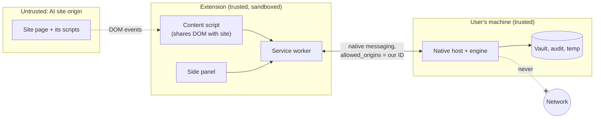

# Redactit threat model

What Redactit protects, from whom, where the trust boundaries are, and which control
covers each threat. Each control names the test or design section that enforces it.
Update this file in the same PR as any change that moves a boundary.

## 1. Assets

| Asset | Where it lives | Why it matters |
|---|---|---|
| Original content (text, files, clipboard) | User's machine (including the watcher's inbox), engine memory | The thing we exist to keep away from LLM providers |
| Redacted copies | The watcher's outbox and its private staging folder; the clipboard after `redactit clip` | Pseudonymised, but file names and context stay; the watcher deletes its outbox copies after the vault's retention period, 30 days by default (PLAN §2.1) |
| Index of redacted copies | `copies.json` in the user data folder | Names each kept copy's path, and so its file name; decides what the retention purge may delete |
| Pseudonym mappings (`[PERSON_1]` to real value) | Encrypted vault on disk | Reverses the redaction for anyone who reads it |
| Vault key | OS keychain | Decrypts the vault |
| Policy (managed + user) | `policy.yaml` files | Weakening it silently lets data through |
| Audit log | JSONL on disk | Must prove what happened without itself leaking values |
| Models | Local files pinned by SHA-256 | A swapped model can miss entities on purpose |

## 2. Trust boundaries

- **B1, site page to content script.** The content script shares the DOM with code we do
  not control. Anything written into the page can be read by the site.
- **B2, extension to native host.** Chrome only launches the host for origins listed in the
  host manifest. That list contains exactly one extension ID. The host checks the origin
  Chrome passes against the same installed manifest, never the environment, so a process
  that starts the host itself with another origin is refused before the engine loads.
- **B3, engine to disk.** Temp files, the vault and logs are readable by other processes
  running as the same OS user.
- **B4, engine to network.** There is no such path. The engine makes no network calls at
  runtime, and models are fetched only by the setup command.

## 3. Adversaries

| Adversary | Capability | In scope |
|---|---|---|
| LLM provider or site script | Reads anything in the page DOM and anything sent to its servers | Yes, the primary adversary |
| Another extension | Can try to message our host or read the page | Yes |
| Malware running as the same OS user | Reads files, keychain entries, memory | No. Out of scope: it can read the originals directly |
| The user trying to bypass policy | Edits user files, turns the dial down | Yes, up to the admin floor |
| Supply chain (a dependency or model) | Ships malicious code or weights | Partly: pins, hashes, license review; not full code audit |

## 4. Threats and controls

| # | Threat | Boundary | Control | Enforced by |
|---|---|---|---|---|
| T1 | A seeded value survives redaction (missed detection) | Engine | Validators + dictionaries + GLiNER + dial; review for low confidence | Leak test: zero survivors from the admin floor (dial 3) to dial 5 |
| T2 | Text survives in a PDF layer, metadata or embedded image | Engine | Pages rebuilt from images only; every page also goes through the image pipeline | Leak test: re-extract text layer, 300 DPI re-OCR, raw byte search |
| T3 | EXIF/GPS or text chunks survive in an image | Engine | Re-encode from raw pixels | Leak test: metadata dump and byte search |
| T4 | DOCX comments, tracked deletions, headers or `docProps` leak | Engine | All OOXML parts walked; `docProps` dropped from output | Leak test DOCX variants |
| T5 | The site reads a paste before we redact it | B1 | Capture-phase listeners on `window`, registered at `document_start` in every frame; the trusted event is cancelled, or the picked files taken out of the input, before any site listener runs; only redacted data goes back in (PLAN §7) | `tests/e2e/test_round_trip.py`: a real Ctrl+V paste, a desktop file drop (DevTools drag events) and a file pick reach the page's own window-capture listeners only as redacted synthetic events, and no raw value is in any event, DOM mutation or markup the page holds, on the claude.ai layout and on a page whose adapter turned itself off. Live sites: the owner's manual script (PLAN §11) |
| T6 | Re-mapped real names are exposed to the site | B1 | Re-mapping only inside the side panel (an extension page); never written to the site DOM. Content scripts only ever receive host output, and the review API answers extension pages only | Design rule, PLAN §6; `tests/unit/test_extension.py` (no logging, no network in extension code); `tests/e2e` checks the page for raw values; review check of the side panel when it lands |
| T7 | Upload proceeds while the engine is down | B1/B2 | Fail closed: a missing or exited host, 2 minutes of silence (10 for files), a request held past 30 s of warm-up, an engine error or a protocol violation blocks the paste or upload, with a notice that says why; a result is used only once every chunk is in and checked | `tests/e2e/test_fail_closed.py`: host not registered, killed mid-request, stuck warming past the (shortened) limit, engine unavailable, a frame outside the protocol, and a cancel: the paste and the upload are blocked and the page sees nothing |
| T8 | Another extension or process drives the native host | B2 | `allowed_origins` with one fixed ID; host also checks the origin argument Chrome passes against the installed manifest | `tests/test_host.py`: a wrong origin and the unfilled template are refused before the engine loads; `tests/unit/test_native.py`: the manifest must allow exactly one well-formed ID. Registration itself: installer test (Phase 7) |
| T9 | Oversized or malformed native messages crash the host or truncate data | B2 | Length-prefixed frames, 512 KiB chunks with checked sequence numbers and totals, strict JSON schema, caps per message, payload and in-flight requests | `tests/unit/test_native.py` (schema, reassembly); `tests/test_host.py` (bad length, bad JSON, oversized message, wrong sequence number, unknown type, caps; a multi-MB PDF and image byte-identical to the engine's output) |
| T10 | Raw values end up in logs, exceptions or the audit file | B3 | Audit stores types, counts, rule IDs and scores only; logging filter; sanitised exception type; the native host's errors are fixed text and library output on its stderr is withheld | Leak test scans logs and audit file (Phase 2); `tests/test_host.py` checks the host's errors, stderr and audit file |
| T11 | Temp files are left behind or readable by others | B3 | Memory by default; formats and the native host write no temp files. The folder watcher stages each output in a `mkdtemp` folder inside the outbox (0700; on Windows a protected owner-only ACL, Python 3.12.4 or later) and renames it into place. Each write deletes its temp file in `finally`, the folder is removed in `finally`, and SIGTERM and Ctrl+Break are turned into Ctrl+C so every stop path runs that cleanup. The index of redacted copies is written to a temp file beside it in the data folder (0600 on POSIX; on Windows the folder's ACL, user-only under the profile), renamed into place, and the temp file is deleted in `finally` | `tests/unit/test_watcher.py`: the folder is private (mode or `icacls`) and empty after every file, after a failed rename and after Ctrl+C in the middle of a write; `tests/test_watch.py`: none left after a round trip, or after `redactit watch` is stopped from the keyboard |
| T12 | Vault read from disk | B3 | AES-256-GCM, key in OS keychain, 30-day purge | Vault unit tests (Phase 2) |
| T13 | User weakens the policy | Engine | Managed layer, tighten-only merge, locked types | Policy merge tests (Phase 2) |
| T14 | Engine phones home or downloads at runtime | B4 | Only `setup-models` has network code; `safety.block_network()` refuses IP sockets and DNS in the engine process; sockets disabled in tests | `tests/test_offline.py` |
| T15 | Tampered or swapped model file | B4 | SHA-256 verified on every load, no hash cache, including RapidOCR's bundled files; on Windows the file is held against writes and deletes until loaded (the file, not the folders on its path: §5), elsewhere hashed again after loading; download only in setup | `tests/unit/test_models.py`: tampered GLiNER, YuNet and RapidOCR files refused; a write, rename or delete during the hold fails (Windows); a change during loading is caught by the second hash |
| T16 | Clipboard captures a password-manager secret | Engine | Items marked concealed are skipped before their text is read (markers per OS in PLAN §2.1), and the engine is never loaded for them; on macOS and Linux, where the check and the read are separate calls, text is refused if the clipboard changed or became concealed in between; redaction only on a keypress, no monitoring | `tests/unit/test_clipboard.py`: Windows, macOS and Linux markers with the OS calls replaced, and a change between check and read; `tests/test_clip.py`: a concealed item on the real Windows clipboard is left unchanged (skipped where no clipboard can be opened) |
| T17 | Copyleft dependency creeps in | Supply chain | License test fails on anything outside MIT/Apache/BSD unless flagged | `tests/test_licenses.py` |
| T18 | Remote code in the extension | Supply chain | Chrome's default MV3 CSP (the manifest does not override it), no `eval`, no remote scripts, no build step | `tests/unit/test_extension.py`: exact permissions, no CSP or externally-connectable keys, no `eval`, `new Function`, remote URL, fetch or logging in extension code |
| T19 | The retention purge deletes a file Redactit did not write, or deletes through a link | B3 | Only files in Redactit's own index (`copies.json` in the data folder, never the outbox) are candidates. One is deleted only if it is older than the policy's `vault.retention_days` (30 by default), still has its recorded file ID, size and mtime, is a regular file and not a link or a reparse point naming another path (the watcher's link rule), and is not in the current inbox. Anything else is dropped from the index and left alone, so the user's own files in an `--outbox` folder and copies they edited or replaced are never deleted. The index is replaced by an atomic rename; one that cannot be read or does not parse exactly deletes nothing. The `copies_purge` audit event carries counts only | `tests/unit/test_copies.py`: an expired copy deleted and a newer one kept; the user's own file, an edited copy and a replaced copy kept; a symlink, and a stood-in reparse point with a matching fingerprint, kept with what they name; the inbox untouched; a corrupt, half-written or unreadable index and a failed save delete nothing; the audit event's fields. `tests/unit/test_watcher.py`: every output recorded; purges at start-up and while running; an earlier outbox watched as the inbox untouched; a 7-day policy deletes an 8-day-old copy through `redactit watch` |

## 5. Residual risks

- **Context re-identification.** "The CEO of [ORG_1] who founded it in 1998" can still
  identify someone. Redactit removes values, not inferences.
- **Unusual entities the model does not know.** Recall is measured, not guaranteed.
  Company dictionaries and review mode are the mitigation.
- **Clipboard concealment on Linux** relies on a KDE-originated hint. GNOME and some Wayland
  compositors do not set it, so a copied password there looks like normal text.
- **Unmarked secrets on the clipboard.** Concealment works only when the password manager
  marks the item. An unmarked password is redacted like any other text: it passes
  through the engine's memory and comes back changed only if a detector recognises it.
- **Clipboard history.** `redactit clip` replaces the current item only. Windows
  clipboard history (Win+V), cloud clipboard sync and third-party clipboard managers keep
  the original copy.
- **Watcher file names.** Outputs keep their input's name, and a name can itself be
  sensitive. Log lines and the audit file leave names out; the outbox cannot, and the
  index of copies in the data folder holds each copy's path until the copy is deleted.
- **Hard stop of the watcher.** A power cut or a forced kill skips `finally` and can leave
  the private staging folder in the outbox, holding at most one partial output. That
  output is already redacted; original content is never written there. A kill while the
  index of copies is saved can leave a temp file beside it in the data folder; the index
  itself is the old one or the new one, never part of either.
- **Purge checks, then deletes.** The checks and the delete are separate calls, so a file
  put in place of an expired copy in the instant between them would be deleted. Deleting
  a link removes the link, never what it names. Only a process running as the user can
  make such a swap (§3).
- **Copies that are not deleted.** Retention runs only while the watcher runs, so copies
  of a watcher never started again stay. A copy whose record was lost is kept for good:
  the index could not be written when it was made, two watchers saved the index at once,
  or the index was found corrupt and started again. Each fails towards keeping a copy,
  never deleting a file; the user removes such copies by hand.
- **Watcher restart on Windows.** At start-up, a file counts as done when its outputs are
  newer than its times. A file moved in from the same drive, or copied over an input of
  the same name, while the watcher was stopped can keep older times. It is then not
  redone, and the outbox keeps the earlier version's output. While the watcher runs, the
  file's new fingerprint catches the change.
- **Paths into a page the extension does not see.** It intercepts pastes, drops and
  `<input type="file">` picks. A site that reads the clipboard itself
  (`navigator.clipboard.read`, after the user grants it), or opens files through
  `showOpenFilePicker`, bypasses it; none of the three sites is known to, but the adapters
  are unverified (PLAN §7). Typed text is not intercepted at all.
- **Notice presence.** The in-page notice's text is in a closed shadow root, but the site
  can see that a notice element appeared, and so that Redactit is installed and acted.
- **Same-user malware** can read the keychain and originals. Out of scope.
- **Leak-test span dump.** Precision needs digests of redacted values. Unsalted digests of
  low-entropy IDs (SIN, SSN) are reversible, so that dump is test-only, used on synthetic
  data, and never written in normal operation.
- **Model swap race outside Windows.** A process with write access to the model folder
  could swap a model in and back between the hash and the second hash on macOS or Linux.
  Such a process could already change the installed packages.
- **Model path re-pointed on Windows.** The Windows hold does not stop a process running
  as the same user from re-pointing a junction, or renaming a parent folder, on the path
  to a model between the hash and the load. The held file stays unchanged, but the loader,
  which opens the model by path, then reads a different file. Such a process already has
  the user's rights, and could change the installed packages or the models themselves, so
  this is a recorded residual risk, not fixed. Closing it would mean loading each model
  from the bytes that were hashed, which costs about 633 MB of resident memory, as
  measured.
- **macOS shortcut binding** needs one manual step: the user assigns the key to the
  installed Quick Action (PLAN §2.1). Until then, clipboard redaction on macOS runs only
  from the CLI.
