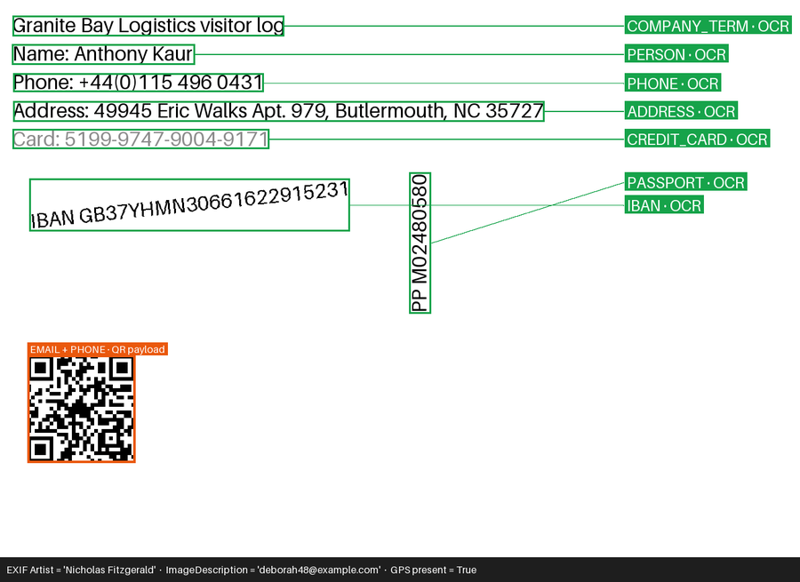
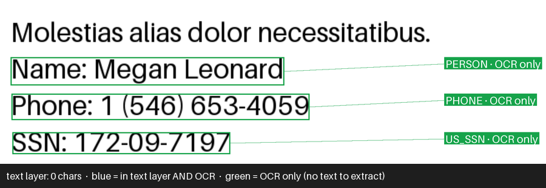
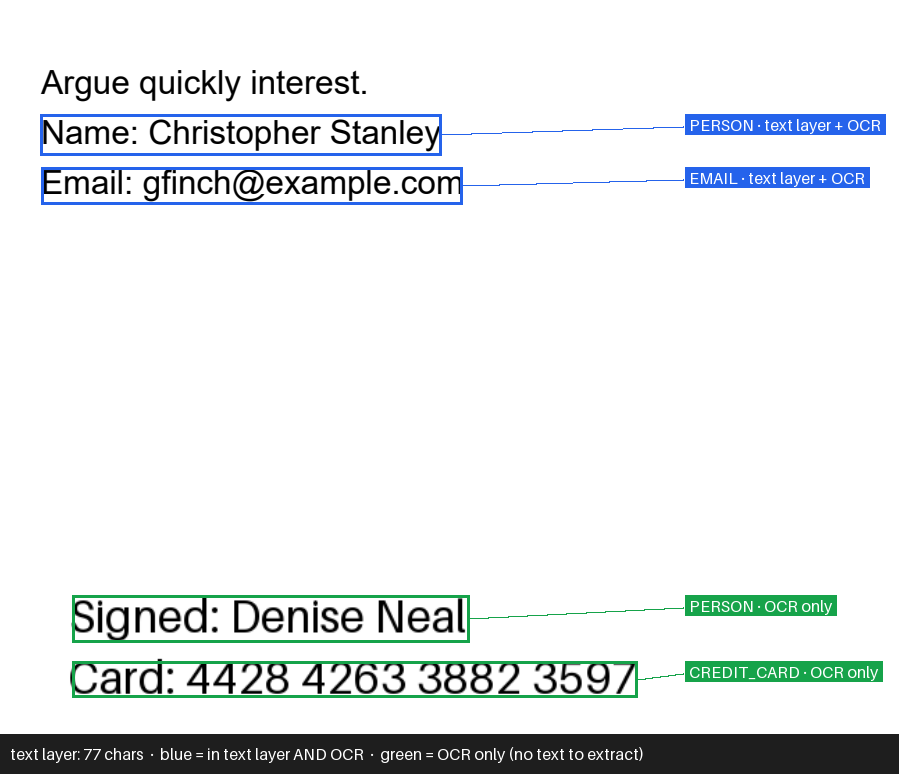
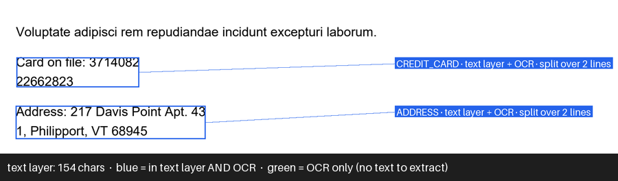

# Phase 1 leak report: pass-through run

Corpus seed 1234, `--outputs` pointed at the unredacted inputs. This run passes when **every**
seeded value survives: it proves the harness can see leaks in every format before any
redactor is trusted. All 132 were found by a format-aware extractor (text, OOXML, PDF text
layer, 300 DPI OCR, image OCR, barcode or metadata), none by raw byte search alone. The 18
violations are the inputs' own text layers and metadata, also expected here.

Survivors: **132** of 132 seeded values.
Metadata / text-layer violations: **18**.

| Format / entity | Seeded | Removed | Recall |
|---|---:|---:|---:|
| docx/ADDRESS | 2 | 0 | 0% |
| docx/COMPANY_TERM | 2 | 0 | 0% |
| docx/CREDIT_CARD | 2 | 0 | 0% |
| docx/EMAIL | 4 | 0 | 0% |
| docx/IBAN | 2 | 0 | 0% |
| docx/PERSON | 16 | 0 | 0% |
| docx/UK_NINO | 2 | 0 | 0% |
| docx/US_SSN | 2 | 0 | 0% |
| jpg/ADDRESS | 2 | 0 | 0% |
| jpg/COMPANY_TERM | 2 | 0 | 0% |
| jpg/CREDIT_CARD | 2 | 0 | 0% |
| jpg/EMAIL | 4 | 0 | 0% |
| jpg/IBAN | 2 | 0 | 0% |
| jpg/PASSPORT | 2 | 0 | 0% |
| jpg/PERSON | 4 | 0 | 0% |
| jpg/PHONE | 4 | 0 | 0% |
| md/API_KEY | 2 | 0 | 0% |
| md/CA_SIN | 2 | 0 | 0% |
| md/COMPANY_TERM | 2 | 0 | 0% |
| md/CREDIT_CARD | 2 | 0 | 0% |
| md/EMAIL | 2 | 0 | 0% |
| md/PERSON | 4 | 0 | 0% |
| md/PHONE | 2 | 0 | 0% |
| pdf/ADDRESS | 2 | 0 | 0% |
| pdf/COMPANY_TERM | 2 | 0 | 0% |
| pdf/CREDIT_CARD | 4 | 0 | 0% |
| pdf/DATE_OF_BIRTH | 2 | 0 | 0% |
| pdf/EMAIL | 4 | 0 | 0% |
| pdf/PERSON | 8 | 0 | 0% |
| pdf/PHONE | 2 | 0 | 0% |
| pdf/US_SSN | 2 | 0 | 0% |
| png/ADDRESS | 2 | 0 | 0% |
| png/COMPANY_TERM | 2 | 0 | 0% |
| png/CREDIT_CARD | 2 | 0 | 0% |
| png/EMAIL | 4 | 0 | 0% |
| png/IBAN | 2 | 0 | 0% |
| png/PASSPORT | 2 | 0 | 0% |
| png/PERSON | 4 | 0 | 0% |
| png/PHONE | 4 | 0 | 0% |
| txt/ADDRESS | 2 | 0 | 0% |
| txt/COMPANY_TERM | 2 | 0 | 0% |
| txt/CREDIT_CARD | 2 | 0 | 0% |
| txt/DATE_OF_BIRTH | 2 | 0 | 0% |
| txt/EMAIL | 2 | 0 | 0% |
| txt/PERSON | 2 | 0 | 0% |
| txt/PHONE | 2 | 0 | 0% |

Precision: not measured (no --spans file)

## Edge cases, shown

Each screenshot is a corpus input with the harness's detections drawn on it. A value is boxed
where the verifier read it back, labelled with the extraction path that caught it. All values
are synthetic (Faker, seed 1234).

### Image: OCR, rotation, low contrast, QR payload, EXIF

- Grey low-contrast card number, 12-degree IBAN and vertical passport number are all read by
  OCR, which runs at 0, 90 and 270 degrees plus a 2x upscale.
- The QR code is decoded, and its payload (email + phone) is matched like any other text.
- EXIF `Artist`/`ImageDescription` hold a name and an email, and a GPS block is present. The
  metadata dump catches the values, and any EXIF at all counts as a violation.

### PDF with no text layer (scanned)

The text layer is empty, so only the 300 DPI render plus OCR can see these values. A verifier
that read only the text layer would report zero leaks here.

### PDF with text in an embedded image (mixed)

Blue values are in the text layer *and* visible to OCR. Green values exist only inside an
embedded image: the text layer has no trace of them, and OCR catches them.

### PDF with values wrapped across lines

The card number and address each break across two lines. Matching drops separators and line
breaks before comparing, so the split value still counts as one surviving value.

### DOCX parts a naive text extractor misses

| Where | XML excerpt (synthetic) | Caught because |
|---|---|---|
| Comment and its author | `<w:comment w:author="Roger Moore" …><w:t>Please double check Miss Leanne Davies at elara@example.net.</w:t>` | every XML part is read, attribute values included |
| Tracked deletion | `<w:del w:author="Nicole Vazquez" …><w:delText>4004 6554 9692 6600</w:delText></w:del>` | deleted text is still in the file, so it is extracted too |
| Value split across runs | `<w:r><w:t>ZR83</w:t></w:r><w:r><w:t>6708D</w:t></w:r>` | tags are stripped before matching, so adjacent runs join into `ZR836708D` |
| Document properties | `<dc:creator>Heather Watson</dc:creator><cp:lastModifiedBy>Albert Rowe</cp:lastModifiedBy>` | `docProps/core.xml` is read like every other part |
