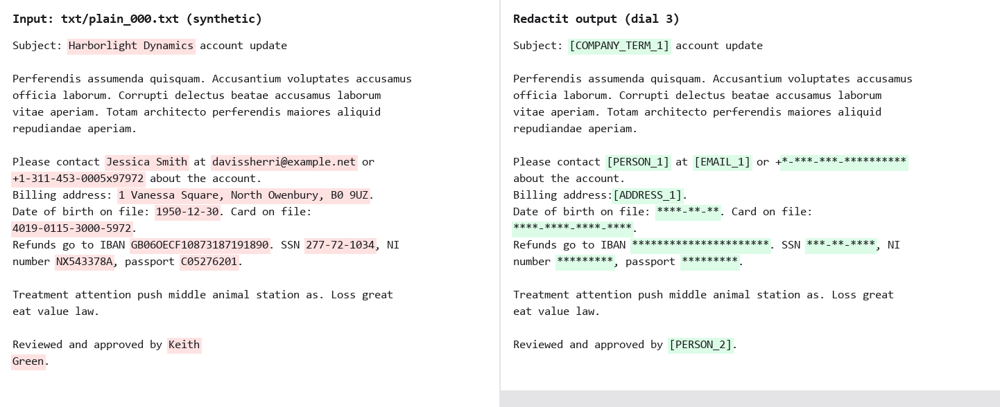
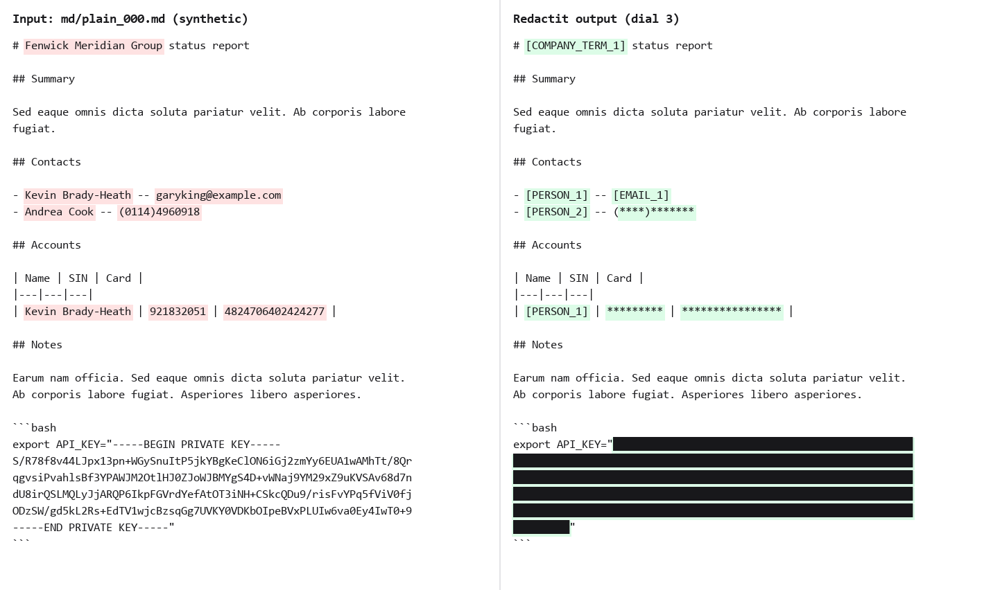
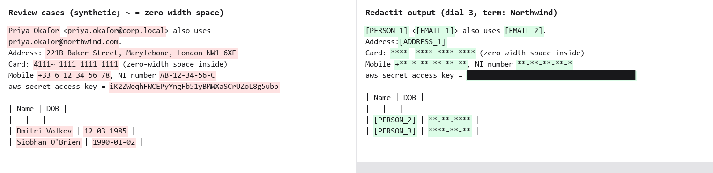

# Phase 2 leak report: text and Markdown

The real engine (patterns, validators, company terms and the GLiNER model) redacted the
synthetic corpus, and the leak harness then re-read every output independently. Five
corpus seeds were used (7, 99, 1234, 2024, 31337), five documents per variant, all values
synthetic.

## Result

| Dial | Planted values | Survivors | Precision |
|---|---:|---:|---:|
| 3 (default and admin floor) | 500 | **0** | 524 / 525 = 0.998 |
| 5 (tightest) | 500 | **0** | 524 / 526 = 0.996 |

No planted value appeared in the audit log. Precision is the share of redacted spans whose
exact value was a planted one; a span covering only part of a value counts against it.

| Entity type | Planted | Removed | Recall |
|---|---:|---:|---:|
| ADDRESS | 25 | 25 | 100% |
| API_KEY | 25 | 25 | 100% |
| CA_SIN | 25 | 25 | 100% |
| COMPANY_TERM | 50 | 50 | 100% |
| CREDIT_CARD | 50 | 50 | 100% |
| DATE_OF_BIRTH | 25 | 25 | 100% |
| EMAIL | 50 | 50 | 100% |
| IBAN | 25 | 25 | 100% |
| PASSPORT | 25 | 25 | 100% |
| PERSON | 100 | 100 | 100% |
| PHONE | 50 | 50 | 100% |
| UK_NINO | 25 | 25 | 100% |
| US_SSN | 25 | 25 | 100% |
| **All** | **500** | **500** | **100%** |

## Before and after

Plain text: every planted value is replaced, including a name wrapped across two lines.
Pseudonyms number in reading order.



Markdown: headings, lists, tables and code fences keep their structure. The same person
mentioned twice gets the same pseudonym.



Cases an independent review found surviving an earlier build: an email whose domain is a
company term, an internal-domain email, a UK street address, a card number with a
zero-width space inside, an international phone, a dashed NINO, an AWS secret after its
key name, and birth dates in a table under a DOB header.



## Misses found and fixed during this phase

| Found by | Input | Why it survived | Fix |
|---|---|---|---|
| Screenshot check | "Ms Carolyn Jones" in a Markdown list | Model score 0.646 vs threshold 0.65 | Model types sit 0.15 lower (the model card works at 0.3-0.5) |
| Seed sweep | "USNV Jackson, FPO AE 65210" | Military address shape unknown to the model | Postal-format pattern |
| Seed sweep | Bare phone after "contact ... at email or" | Cue word outside a 40-character window | 80-character window, more cue words |
| Seed sweep | "… Apt. 571, South Jasonport, YT …" | Street pattern stopped at "Apt." | Unit designators; nearby address fragments joined |
| Review | `priya.okafor@northwind.com` with term "Northwind" | Validated sub-span beat the covering span | Overlaps redact their union |
| Review | `priya.okafor@corp.local` | Public-suffix check scored internal domains 0 | Own email pattern |
| Review | `221B Baker Street, Marylebone, London NW1 6XE` | Model scored 0.41-0.44 | Street-type and postcode patterns |
| Review | DOB table rows, `12.03.1985`, `March 12th, 1985` | Cue only looked backwards; formats missing | Table header as cue; more formats |
| Review | Soft hyphen or zero-width space inside a value | Split the value for every pattern | Detection on an NFKC-folded copy, mapped back |
| Review | 12 KB base64 blob | One 8,745-token window, 15+ minutes | Token-budget windows |
| Review, round 2 | `PO Box 4417, …`, `Unit 7, Harbourside Business Centre, Plymouth PL4 0RA` | No pattern; model missed | PO box and unit patterns; parts before a postcode |
| Review, round 2 | DOB rows in a table without leading pipes | Header lookup required a leading `|` | Pipe-less tables; memoised header lookup |
| Review, round 2 | `SS no. 219099999` | Bare 9 digits scored below the locked threshold | Bare 9-digit runs masked; wider SSN cue |
| Review, round 2 | `priya.okafor@müller-bau.de` | ASCII-only domain pattern | Unicode domain labels |

## Known gaps

- **House names without a number or postcode** ("Rosewood Cottage, Little Snoring, Norfolk")
  depend on the name model alone; no pattern can recognise them.
- **Network block:** code that imports Python's private `_socket` module directly bypasses
  the block, and on Windows `socket.socketpair()` is refused because it uses a loopback
  socket. Phase 4's native host must not rely on asyncio's default event loop on Windows.
- **Admin policy on Windows:** only the file's owner is checked, not its access list; the
  Phase 7 installer creates the folder with admin-only write access.

## Reproduce

```bash
py -3.12 -m uv run python tests/corpus/generate.py --seed 1234 --out tests/corpus/out --per-variant 5
```

```bash
py -3.12 -m uv run python tests/leak/redact_corpus.py --corpus tests/corpus/out --out tests/leak/redacted --dial 3
```

```bash
py -3.12 -m uv run python tests/leak/run.py --corpus tests/corpus/out --outputs tests/leak/redacted --spans tests/leak/redacted/spans.jsonl --formats txt,md
```
