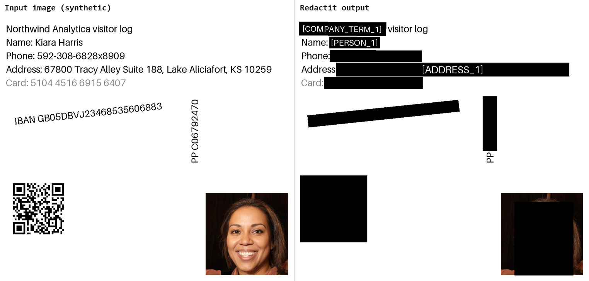
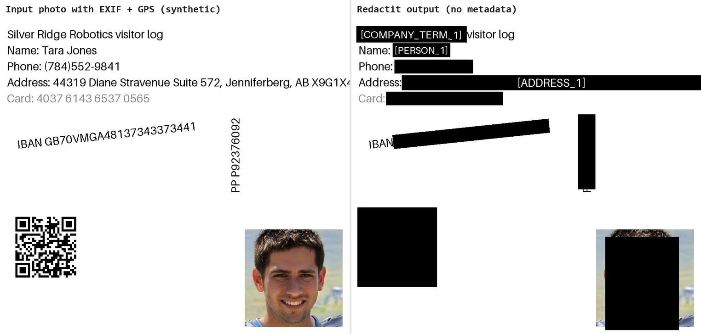
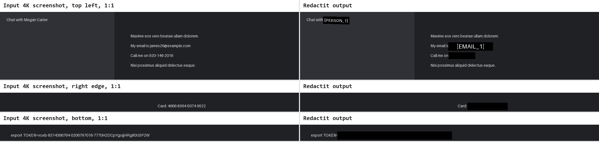
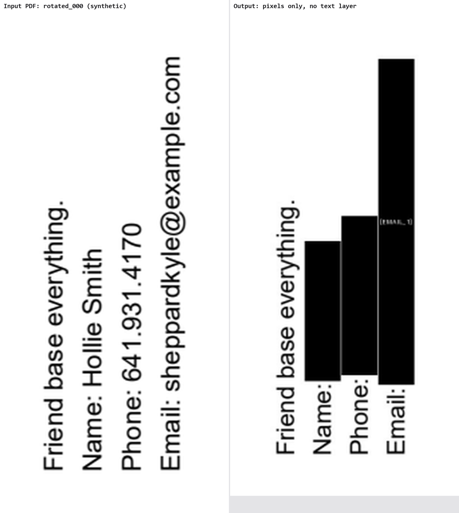
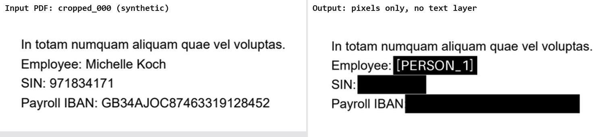
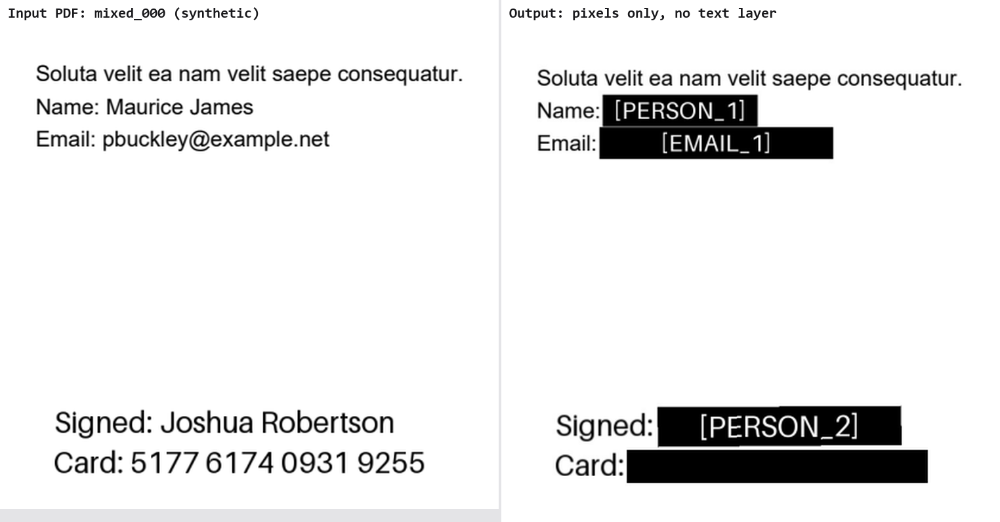
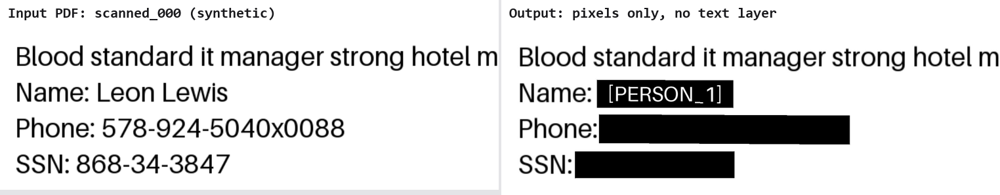
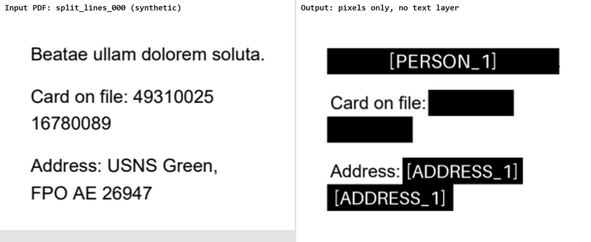
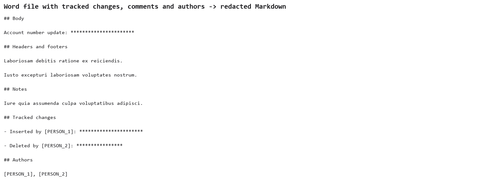

# Phase 3 leak report: Word, PDF and images

Every MVP format now goes through the real engine: the Word document, text layer, OCR,
face and barcode detectors, and the image and page rebuild. The leak harness then re-read
each output independently: the text layer, 300 DPI OCR at full size in three rotations,
barcodes, EXIF/PNG metadata, faces and raw bytes. Five corpus seeds were used (7, 99,
1234, 2024, 31337), two documents per variant. All values and faces are synthetic.

## Result (dial 3, the default and admin floor)

| Formats | Planted values | Survivors | Metadata / text-layer / face violations | Precision |
|---|---:|---:|---:|---:|
| txt, md, docx | 360 | **0** | 0 | 385 / 396 = 0.972 |
| pdf, png, jpg | 480 | **0** | 0 | 352 / 385 = 0.914 |

Dial 5 only lowers thresholds, so it redacts a superset. CI runs the txt, md and docx part
at dial 3 and at dial 5 on every PR. The OCR formats take about 25 minutes, so they run
locally.

| Entity type (pdf, png, jpg) | Planted | Removed |
|---|---:|---:|
| PERSON | 110 | 110 |
| EMAIL | 80 | 80 |
| PHONE | 70 | 70 |
| CREDIT_CARD | 50 | 50 |
| ADDRESS | 30 | 30 |
| COMPANY_TERM | 30 | 30 |
| IBAN | 30 | 30 |
| PASSPORT | 20 | 20 |
| FACE | 20 | 20 |
| CA_SIN | 10 | 10 |
| DATE_OF_BIRTH | 10 | 10 |
| US_SSN | 10 | 10 |
| API_KEY | 10 | 10 |

| Precision by format | Redacted spans | On a planted value | Precision |
|---|---:|---:|---:|
| txt | 120 | 117 | 0.975 |
| md | 90 | 88 | 0.978 |
| docx | 186 | 180 | 0.968 |
| pdf | 195 | 188 | 0.964 |
| png | 120 | 105 | 0.875 |
| jpg | 70 | 59 | 0.843 |

Images score lower because a box covers whole OCR words, and OCR sometimes joins a label
to its value ("IBANGB69..."), so the redacted span includes the label.

## The verifier can see what it checks

Run against the untouched inputs, the harness must report every value. The earlier
verifier shrank images to 2000 px, and it reported the name in the 4K screenshot as removed
from the input itself: a real leak there would have passed. It now reads at full size and
reports all of them. The rotated PDF pages first drew their text above the page, so their
values were in the text layer but on no pixel, and that variant tested nothing. The corpus
test now reads only text inside a page's shown area.

## Before and after

An image with a company name, contact details, rotated text, a vertical passport number,
a QR code, a synthetic face, and EXIF with GPS:

A dark-mode 4K screenshot with 14 px text out to its edges, cropped at 1:1:

A page with `/Rotate 270`: each box stays on its own line.

A page with a CropBox, so page space and shown pixels differ by its origin:

A PDF whose second block is an embedded image, so only OCR can see it:

A scanned PDF with no text layer:

A card number and an address wrapped across lines:

A Word file's tracked changes, comments and authors, as redacted Markdown:

## Misses found and fixed during this phase

| Found by | Input | Why it survived | Fix |
|---|---|---|---|
| Image builder | "IBAN GB69..." read by OCR as "IBANGB69..." | Word-anchored patterns need a space before the value | Digit lookarounds; an IBAN finder that tries every position at its country's exact length with mod-97 |
| Image builder | "PP CF581535" read as "PPCF581535" | Same | Passport letters may follow other letters |
| OCR sweep | "SK R3P 1B2" read as "SKR3P1B2" | Postcode pattern needed a word boundary | Digit lookarounds; the part before a postcode may touch it |
| OCR sweep | "Project Slate Orchard" read as "ProjectSlateOrchard" | Company terms required whole words | Terms tolerate missing spaces; long ones may touch other text |
| OCR sweep | IBAN with one character misread | Failed mod-97, so not an IBAN | IBAN-shaped strings of the right length are masked, unvalidated |
| OCR sweep | "PSC 6319, Box 47" / "75, APO AP 11657" | PDF wrapped mid-number | Military address digit groups may break across a line |
| OCR sweep | "2 Josh Plains, Va" / "nessafort, S6 5WJ" | PDF wrapped mid-word | Parts before a postcode continue across a mid-word break |
| Screenshot check | Card and IBAN lines labelled [ADDRESS_2] | The previous fix let an address swallow lines below it | Continue only where a word visibly continues |
| Face builder | GUI OpenCV wheel | Bundled Qt and other LGPL libraries on Linux and macOS | Headless OpenCV; FFmpeg is the only LGPL part that ships |
| Review | 4K screenshot, 14 px text | RapidOCR shrinks to 2000 px by default | Read at full size; tiles past 4096 px |
| Review | Rotated or cropped PDF page | Boxes placed in unrotated page space | Placed through PDFium's page-to-device transform |
| Review | Name under a drawn black box in a PDF | Markdown came from the text layer | Markdown comes from OCR of the shown page |
| 4K sweep | "FPOAE26947", "1505 Combs Crest Apt.044, Calvinfurt, Vl 77725" | Spaces required; "Crest" not a known street type; "VI" misread | Spaces optional; a US "town, ST 12345" rule with OCR's I/l and O/0 swaps |
| 4K sweep | 4 birth dates and 1 address in PDF Markdown | Boxed from the text layer, but OCR glued the cue ("Dateof birth") so the Markdown missed them | OCR text under a text-layer box is replaced before detection |
| 4K sweep | "PSC0489,Box6499,APOAE87326" in an image | Every space gone | Military address spaces optional |
| 4K sweep | "Chat withJenniferRice" | One unknown word to the name model | Split words where a lower-case letter meets a capital |
| 4K sweep | GitHub token read 35 characters long | OCR took "rn" for "m"; the pattern wanted 36 | GitHub tokens count from 30 characters |
| Screenshot check | Rotated page: next lines painted over, wrong labels in Markdown | Padding taken from the line's length on a sideways box | Pad by the shorter side; order OCR lines in their own reading direction |

## Known gaps

- **Barcode payloads are not decoded for redaction.** Every barcode is boxed because BARCODE
  is locked. Unlocking it would ship barcodes unredacted, so keep it locked.
- **House names, and street lines with an uncommon street type ("Crest") but no ZIP or
  postcode,** still depend on the name model.
- **OCR speed:** about 3.5 s per image and 4-6 s per PDF page on a laptop CPU.
